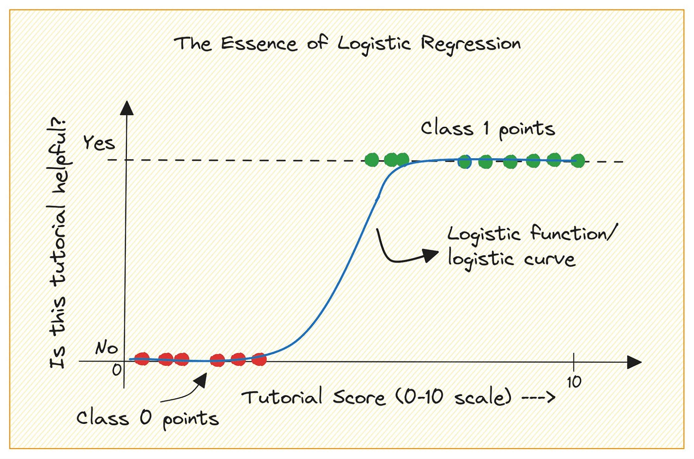
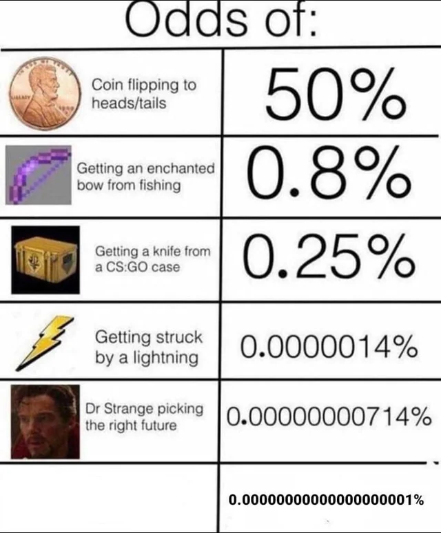

## _Outline_

* Mengapa regresi linear tidak bisa digunakan untuk _outcome_ biner?
* Rantai konsep: probabilitas, *odds*, *log odds*, dan *odds ratio*
* Persamaan model & interpretasi koefisien
* Estimasi model: *Maximum Likelihood* dan uji *fit*
* Model dengan banyak prediktor
* Asumsi regresi logistik
* Evaluasi akurasi prediksi
* Pelaporan hasil

# Variabel biner dalam penelitian psikologi {background-color="#14497F" .center}

## *Outcome* biner ada di berbagai konteks

::: {.incremental}
* **Putus studi PJJ:** Sepertiga mahasiswa PJJ tidak menyelesaikan studinya sebelum semester kelima ([Tinto, 1987](https://press.uchicago.edu/ucp/books/book/chicago/L/bo3630345.html); [Park & Choi, 2009](https://www.jstor.org/stable/jeductechsoci.12.4.207))
* **Relapse gangguan kecemasan:** 40–60% pasien mengalami kekambuhan dalam jangka panjang setelah remisi ([Bruce et al., 2005](https://psychiatryonline.org/doi/full/10.1176/appi.ajp.162.6.1179))
* **Turnover karyawan:** 15–20% per tahun dianggap normal; di atas angka itu menandakan masalah organisasi (SHRM, 2023)
* **Percobaan bunuh diri:** Sekitar 2.4% prajurit militer AS melakukan percobaan bunuh diri dalam satu tahun ([Kessler et al., 2014](https://pmc.ncbi.nlm.nih.gov/articles/PMC4860903/))
:::

::: {.callout-note}
#### _Outcome_ Biner
*Outcome* dari semua penelitian di atas bukan skor 1–100 (data _continous_). Mereka adalah **keputusan biner**: terjadi (1) atau tidak terjadi (0). Kita membutuhkan metode statistik yang dirancang untuk memodelkan **probabilitas** kejadian seperti ini.
:::

# Mengapa bukan regresi linear? {background-color="#14497F" .center}

## Regresi linear dan prediksi yang mustahil

Misalnya kita ingin memprediksi **putus studi mahasiswa PJJ** berdasarkan jarak ke kelompok belajar (pokjar):

| Mahasiswa | Jarak ke pokjar | Prediksi P(putus studi) dengan OLS | Valid? |
|-----------|:---------------:|:----------------------------------:|:------:|
| A | 5 km | 0.25 | ✓ |
| B | 50 km | **1.45** | ✗ |
| C | 0 km | **−0.10** | ✗ |

: {tbl-colwidths="[20,25,40,15]"}

* **Masalah fundamental:** Probabilitas harus berada di **rentang 0 sampai 1**. Regresi linear tidak menjamin ini — ia memodelkan hubungan linear tanpa batas (∞).
* **Yang dibutuhkan:** Sebuah fungsi yang secara otomatis *membatasi* prediksi dalam rentang [0, 1].

## Solusi: fungsi logistik (kurva S)

::: {.columns}
::: {.column width="55%"}

$$P = \frac{1}{1 + e^{-(\beta_0 + \beta_1 X)}}$$

Tiga sifat penting kurva S (*sigmoid*):

* **Asimptot bawah = 0** — probabilitas tidak pernah negatif
* **Asimptot atas = 1** — probabilitas tidak pernah melampaui 1
* **Transisi halus di bagian tengah** — perubahan probabilitas melambat di ujung-ujungnya

::: {.callout-note}
#### Rentang _outcome_ selalu 0-1 meskipun prediktor nilainya ekstrim
Tidak peduli seberapa ekstrim nilai prediktor (X), probabilitas yang diprediksi **tetap berada dalam rentang yang valid**. Inilah keunggulan utama regresi logistik dibanding OLS untuk *outcome* biner.
:::
:::
::: {.column width="45%"}
{fig-align="center"}
:::
:::
<!-- end columns -->

# Rantai konsep: P → Odds → Log Odds → Odds Ratio {background-color="#14497F" .center}

## Probabilitas 1️⃣

$$P(A) = \frac{\text{jumlah kejadian A}}{\text{total kemungkinan}}$$

**Contoh:**

| Konteks | Probabilitas |
|---------|:------------:|
| 135 dari 450 mahasiswa putus studi sebelum semester ke-5 | P(putus studi) = 0.30 |
| 8 dari 200 mahasiswa pernah mencoba bunuh diri | P(percobaan) = 0.04 |
| 60 dari 200 karyawan *resign* dalam 1 tahun | P(turnover) = 0.30 |

: {tbl-colwidths="[75,25]"}

## Probabilitas 2️⃣

* Regresi logistik **tidak memodelkan probabilitas secara langsung** 
* Yang dimodelkan adalah transformasinya, yaitu *log odds*
* Mengapa? 
  - Karena probabilitas tidak linear, sementara *log odds* bisa diperlakukan sebagai linear terhadap prediktor

## *Odds*

$$\text{Odds} = \frac{P}{1 - P}$$

**Definisi:** "_Berapa kali suatu kejadian lebih mungkin terjadi dibandingkan tidak terjadi_"
**Contoh:** Jika P(putus studi) = 0.30, maka Odds = 0.30 / 0.70 = **0.43**

Cara baca: "Untuk setiap 7 mahasiswa yang bertahan, ada 3 yang putus studi" (3:7)

| P(kejadian) | Odds | Cara baca |
|:-----------:|:----:|-----------|
| 0.10 | 0.11 | 1 banding 9 |
| 0.25 | 0.33 | 1 banding 3 |
| 0.50 | 1.00 | Sama rata |
| 0.75 | 3.00 | 3 banding 1 |
| 0.90 | 9.00 | 9 banding 1 |

: {tbl-colwidths="[25,25,50]"}

## Interpretasi _odds_

::: {.columns}
::: {.column}
* Odds = 1 artinya peluang terjadi **sama dengan** tidak terjadi. 
* Odds > 1 artinya **lebih mungkin** terjadi (vs. tidak terjadi). 
* Odds < 1 artinya **lebih tidak mungkin** terjadi (vs. tidak terjadi).

:::
::: {.column}

{fig-align="center"}
:::
:::
<!-- end columns -->

## *Log odds* (logit) — membuat *odds* simetris dan linear

**Masalah *odds*:** Rentangnya 0 sampai ∞, dan tidak simetris — nilai di bawah 1 terkompresi, nilai di atas 1 tidak terbatas.

**Solusi: *Log odds* (logit)**

## *Log odds* (logit) — membuat *odds* simetris dan linear

$$\text{Logit}(P) = \ln\!\left(\frac{P}{1-P}\right)$$

| P | Odds | Logit |
|:---:|:---:|:---:|
| 0.10 | 0.11 | −2.20 |
| 0.25 | 0.33 | −1.10 |
| 0.50 | 1.00 | 0.00 |
| 0.75 | 3.00 | +1.10 |
| 0.90 | 9.00 | +2.20 |

: {tbl-colwidths="[33,34,33]"}

Perhatikan: *logit* simetris di sekitar 0 dan rentangnya −∞ sampai +∞. **Inilah yang dimodelkan secara linear** oleh regresi logistik.

## Persamaan model regresi logistik

**Persamaan dalam *logit* (yang berjalan di belakang layar):**

$$\ln\!\left(\frac{P}{1-P}\right) = \beta_0 + \beta_1 X_1 + \beta_2 X_2 + \cdots + \beta_k X_k$$

**Untuk memprediksi probabilitas, balik transformasinya:**

$$P = \frac{1}{1 + e^{-(\beta_0 + \beta_1 X_1 + \cdots + \beta_k X_k)}}$$

**Komponen:**

* β₀ = *intercept* (*log odds* ketika semua prediktor = 0)
* β₁, …, βₖ = koefisien regresi (perubahan *logit* per satu unit prediktor)
* **e^β = *Odds Ratio***  **inilah yang diinterpretasikan dalam sebagai _effect size_ dari regresi logistik**

## *Odds Ratio* (OR) — _effect size_ utama

_Odds ratio_ (OR) merupakan _effect size_ utama dari model regresi logistik.

$$OR = e^{\beta}$$

OR mengukur seberapa banyak *odds* berubah ketika prediktor naik 1 unit, dengan prediktor lain dikontrol.

## *Odds Ratio* (OR) — _effect size_ utama

| OR | Interpretasi |
|:--:|--------------|
| = 1.00 | Tidak ada efek |
| > 1.00 | *Odds* *outcome* **naik** |
| < 1.00 | *Odds* *outcome* **turun** |
| = 1.50 | *Odds* naik 50% |
| = 2.00 | *Odds* naik 100% (dua kali lipat) |
| = 0.50 | *Odds* turun 50% (setengahnya) |

: {tbl-colwidths="[20,80]"}

::: {.callout-warning}
#### Selalu laporkan 95% *Confidence Interval* untuk OR! 
Jika CI melewati 1.0, prediktor tidak signifikan secara statistik — misalnya OR = 1.20, 95% CI [0.85, 1.69] → tidak signifikan.
:::

## Studi kasus: apa yang memprediksi putus studi PJJ?

**Konteks:** 450 mahasiswa PJJ; 30% putus studi sebelum semester ke-5

**Prediktor:** Jarak ke pokjar, keterlibatan akademik, kecemasan akademik awal

| Prediktor | β | OR | 95% CI | p | Interpretasi |
|-----------|:---:|:---:|--------|:---:|--------------|
| Jarak (per 10 km) | 0.49 | 1.63 | [1.21, 2.19] | <.001 | Jarak +10 km → *odds* +63% |
| Keterlibatan akademik | −0.65 | 0.52 | [0.38, 0.71] | <.001 | Keterlibatan ↑ → *odds* −48% |
| Kecemasan akademik | 0.02 | 1.02 | [0.99, 1.05] | .182 | Tidak signifikan |

: {tbl-colwidths="[30,8,8,20,10,24]"}

::: {.callout-tip}
#### Interpretasi
Keterlibatan akademik yang tinggi dapat "**mencegah**" efek jarak yang jauh antara tempat tinggal mahasiswa dengan pokjar. Bisa dijadikan dasar untuk mendesain intervensi program PJJ.
:::

# Estimasi & Ketepatan Model {background-color="#14497F" .center}

## *Maximum Likelihood Estimation* (MLE)

**Regresi linear (OLS):**

Cari β yang **meminimalkan** jumlah kuadrat *error* (SSE)

**Regresi logistik (MLE):**

Cari β yang membuat variabel _outcome_ yang kita observasi **"paling mungkin terjadi"**

::: {.callout-note}
#### Mengapa MLE❓
Karena MLE, kita **tidak mendapatkan F-statistics** seperti dalam OLS/ANOVA. Sebagai gantinya, kita mendapatkan **χ²** sebagai uji signifikansi keseluruhan model.

Jika _software_ menampilkan peringatan `algorithm did not converge`, biasanya tanda sampel terlalu kecil atau ada *perfect separation* (lihat bagian berikutnya).
:::

## *Deviance* & *Likelihood Ratio Test* — uji omnibus model

**Deviance** = −2 × *log-likelihood* (makin kecil, makin baik)

| Terminologi | Nilai Deviance | Interpretasi |
|--|:---------:|------|
| **Null deviance** | 612.4 | Model tanpa prediktor (_null model_) |
| **Residual deviance** | 487.2 | Model dengan prediktor |
| **Penurunan** | **125.2** | Bukti bahwa prediktor meningkatkan kemampuan model memprediksi _outcome_ |

: {tbl-colwidths="[30,15,55]"}

## *Deviance* & *Likelihood Ratio Test* — uji omnibus model

**Likelihood Ratio Test:**

$$\chi^2 = \text{Null deviance} - \text{Residual deviance}$$

$$\chi^2(3) = 125.2,\ p < .001 \rightarrow \text{Model secara keseluruhan signifikan!}$$

::: {.callout-note}
#### Uji Omnibus
Ini adalah **uji omnibus** — setara dengan uji F keseluruhan dalam regresi linear. Di `jamovi`, angka ini muncul di bagian *Model Fit* sebagai **Model χ²**.
:::

## AIC & BIC — memilih model terbaik

Prinsipnya sama dengan regresi OLS yang sudah kita pelajari di [Bagian 3](https://rameliaz.github.io/statistik/slides/bagian-3.html#/title-slide): menambah prediktor **selalu** menurunkan *deviance*, bahkan ketika prediktor itu tidak bermakna secara substantif untuk menjelaskan variabel _outcome_ ([*overfitting*](https://en.wikipedia.org/wiki/Overfitting)).

$$\text{AIC} = -2\log L + 2k \qquad \text{BIC} = -2\log L + k\ln(n)$$

Di mana k = jumlah parameter, n = ukuran sampel. **Makin kecil, makin baik — hanya bermakna kalau ada model lain yang digunakan sebagai perbandingan.**

| Model | Prediktor | AIC | BIC | |
|-------|-----------|:---:|:---:|-|
| Model 1 | Jarak saja | 502.1 | 510.3 | |
| Model 2 | Jarak + Keterlibatan | 489.7 | 502.1 | ← Terbaik |
| Model 3 | Jarak + Keterlibatan + Usia + Gender | 493.2 | 518.9 | |

: {tbl-colwidths="[10,42,12,12,24]"}

Model 2 paling baik: model *fit* baik (AIC lebih kecil dari Model 1) dan tidak terlalu kompleks (BIC paling kecil diantara model yang lain). BIC lebih ketat dari AIC karena penaltinya lebih besar. Pilih BIC jika prioritasnya memilih model yang paling sederhana (parsimoni).

## Pseudo R² — seberapa banyak variasi yang dijelaskan?

* Regresi logistik tidak punya R² seperti OLS karena tidak ada "total *variance*" yang bisa dibagi seperti dalam OLS.
* **Solusinya Pseudo R²** 
  — Ada beberapa versi, yang paling sering digunakan adalah **Nagelkerke R²:**

## Interpretasi Pseudo R²

| Nagelkerke R² | Interpretasi |
|:-------------:|--------------|
| < 0.20 | Lemah |
| 0.20–0.40 | Cukup |
| 0.40–0.60 | Baik |
| > 0.60 | Sangat baik |

: {tbl-colwidths="[30,70]"}

* Pseudo R² **bukan** "proporsi varians yang dijelaskan" seperti R² OLS, jadi **jangan diinterpretasikan dengan cara yang sama**. Lebih tepat diartikan sebagai _peningkatan model fit dibanding null model._ Nilainya cenderung lebih rendah dari R² OLS.

* Cara melaporkan yang benar: _"Nagelkerke R² = .32, mengindikasikan bahwa model dengan prediktor memberikan peningkatan *model fit* yang substansial dibandingkan model tanpa prediktor."_

# Model dengan Banyak Prediktor {background-color="#14497F" .center}

## Adjusted OR — efek prediktor setelah mengontrol variabel lain

**Masalah *confounding*:** Dalam analisis bivariat, efek yang terlihat bisa dipengaruhi oleh variabel ketiga.

Contoh: Mahasiswa yang tinggal jauh dari pokjar cenderung punya keterlibatan akademik yang lebih rendah (karena kesempatan terlibat lebih terbatas). Efek jarak dan efek keterlibatan **saling tumpang tindih**.

| Prediktor | Unadjusted OR | Adjusted OR | 95% CI |
|-----------|:--------------:|:-------------:|--------|
| Jarak (per 10 km) | 1.70 | 1.63 | [1.21, 2.19] |
| Keterlibatan akademik | 0.48 | 0.52 | [0.38, 0.71] |
| Usia (per 10 tahun) | 1.15 | 1.08 | [0.88, 1.32] |

: {tbl-colwidths="[34,20,20,26]"}

Setelah dikontrol, efek jarak sedikit mengecil — sebagian efeknya bekerja *melalui* keterlibatan akademik.

## Adjusted OR — efek prediktor setelah mengontrol variabel lain

::: {.callout-warning}
#### Laporkan *Adjusted* OR
Dalam artikel ilmiah, **selalu laporkan *adjusted* OR** dari model dengan prediktor berganda, bukan *unadjusted* OR dari analisis bivariat.
:::

## Interaksi — efek prediktor yang berbeda antar subkelompok

**Pertanyaan:** Apakah efek jarak pada putus studi *berbeda* tergantung tingkat keterlibatan akademik?

$$\text{logit}(P) = \beta_0 + \beta_1(\text{Jarak}) + \beta_2(\text{Keterlibatan}) + \beta_3(\text{Jarak} \times \text{Keterlibatan})$$

Masukkan suku interaksi (_interaction terms_) antara `jarak` dan `keterlibatan` di dalam model.

::: {.callout-important}
#### Selalu _Centering_ Prediktor!
Agar _main effects_ dapat diinterpretasi, maka semua prediktor yang dibuatkan suku interaksinya, harus selalu di-_centering_. Artinya, nilai setiap orang dikurangi dengan nilai rata-rata, sehingga nilai 0 = rata-rata.
:::

## Interaksi — efek prediktor yang berbeda antar subgrup

**Hasil:** β₃ = −0.08, p = .03 → Interaksi signifikan!

| Subgrup | Efek jarak pada *odds* putus studi | Interpretasi |
|---------|:----------------------------------:|--------------|
| Keterlibatan **rendah** | OR = 1.12 per km | Jarak ada efeknya |
| Keterlibatan **tinggi** | OR = 1.02 per km | Jarak hampir tidak ada efeknya |

: {tbl-colwidths="[25,35,40]"}

::: {.callout-tip}
#### Interpretasi
Keterlibatan akademik yang tinggi bisa **men-*buffer*** dampak jarak yang jauh, sehingga bisa dijadikan dasar untuk merancang intervensi yang tepat sasaran.
:::

## Strategi membangun model — mulai dari teori

:::: {.columns}
::: {.column width="50%"}

**✅ *Theory-driven* (direkomendasikan)**

1. Pilih prediktor berdasarkan teori dan literatur **sebelum** melihat data
2. Uji hipotesis yang sudah *pre-specified*
3. Laporkan **semua** model yang diuji — bukan hanya yang paling bagus hasilnya secara statistik

:::
::: {.column width="50%"}

**⚠️ *Stepwise selection* (kontroversial)**

* *Forward*: tambahkan prediktor satu per satu berdasarkan p-value
* *Backward*: mulai dari semua prediktor, hapus yang tidak signifikan
* **Masalah:** *Overfitting*, inflasi *Type I error*, hasil sulit dicoba-ulang (replikasi)

:::
::::

::: {.callout-warning}
#### Kapan analisis eksplorasi dibenarkan?
Analisis eksplorasi boleh dilakukan untuk *generate* hipotesis, tapi **harus dipisahkan** dari analisis konfirmatori. Mencampur keduanya dalam satu sampel adalah salah satu bentuk [*questionable research practice*](https://journals.sagepub.com/doi/abs/10.1177/1948550615612150).
:::

# Asumsi Regresi Logistik {background-color="#14497F" .center}

## Lebih longgar dari OLS!🎉

:::: {.columns}
::: {.column width="55%"}

**Yang HARUS dipenuhi:**

1. *Outcome* biner (variabel dependen dikotomus: 0/1)
2. Observasi independen — satu partisipan tidak mempengaruhi yang lain
3. Linearitas dalam *log odds* — prediktor kontinu harus punya hubungan linear dengan logit(P)
4. Tidak ada multikolinearitas ekstrem

:::
::: {.column width="45%"}

**Yang TIDAK perlu:**

* ✗ Normalitas residual
* ✗ Homoskedastisitas
* ✗ *Outcome* kontinu
* ✗ Hubungan linear antara prediktor dan P (hanya harus linear dalam *logit*)

:::
::::

::: {.callout-note}
#### Tetap harus dicek
Meskipun lebih longgar, asumsi yang ada **tetap harus dicek dan dilaporkan**. Terutama multikolinearitas (dengan VIF) dan kemungkinan *perfect separation*.
:::

## Multikolinearitas

Cara memeriksa dan interpretasinya sama persis seperti dalam regresi OLS — gunakan **VIF**:

| VIF | Interpretasi |
|:---:|--------------|
| < 5 | Tidak ada masalah |
| 5–10 | *Moderate* — perlu hati-hati |
| > 10 | Masalah serius |

: {tbl-colwidths="[15,85]"}

**Contoh problem:**
"Durasi studi (semester)" dan "biaya kuliah kumulatif" — keduanya naik bersama, korelasi r = 0.95 → VIF ≈ 18 → model sulit diestimasi secara stabil.

::: {.callout-tip}
`jamovi` menampilkan VIF secara otomatis di *output* regresi logistik — centang **Collinearity Statistics** di opsi **Model Coefficients**.
:::

## *Perfect separation* — ketika prediktor _too goood to be true_

**Masalah:** Satu prediktor memisahkan *outcome* secara sempurna — semua Y = 1 ada di satu sisi, semua Y = 0 di sisi lain.

**Contoh:** Semua mahasiswa dengan jarak > 45 km putus studi (100%). Semua mahasiswa dengan jarak ≤ 45 km lanjut studi (100%).

**Akibat:** Koefisien meluncur ke ±∞, *standard error* sangat besar, model tidak *converge*.

::: {.callout-warning}
#### Tanda-tanda di *output*

* Koefisien sangat besar (β > 10 atau < −10)
* *Standard error* sangat besar
* Pesan _error_ `Algorithm did not converge`

Jika ini terjadi, cek distribusi prediktor dan *outcome* karena umumnya berarti bahwa ada **kejadian yang frekuensi terjadinya terlalu kecil**.
:::

# Evaluasi Akurasi Prediksi {background-color="#14497F" .center}

## *Confusion matrix* — dasar evaluasi akurasi klasifikasi model

Setelah model diestimasi, gunakan *threshold default* P ≥ 0.50 → prediksi *outcome* terjadi; P < 0.50 → prediksi tidak terjadi.

|  | Prediksi: Tidak Terjadi | Prediksi: Terjadi |
|--|:---:|:---:|
| **Aktual: Tidak Terjadi** | 240 **(TN)** | 30 **(FP)** |
| **Aktual: Terjadi** | 50 **(FN)** | 130 **(TP)** |

: {tbl-colwidths="[30,35,35]"}

* **TP** (*True Positive*): Prediksi terjadi → aktual terjadi ✓
* **TN** (*True Negative*): Prediksi tidak terjadi → aktual tidak terjadi ✓
* **FP** (*False Positive*): Prediksi terjadi → aktual tidak terjadi ✗ (*false alarm*)
* **FN** (*False Negative*): Prediksi tidak terjadi → aktual terjadi ✗ (*miss* — sering yang paling berbahaya)

## *Sensitivity*, *specificity*, dan akurasi

Dari *confusion matrix* tadi (TP=130, TN=240, FP=30, FN=50, N=450):

| Metrik | Formula | Nilai | Pertanyaan yang dijawab |
|--------|---------|:-----:|------------------------|
| **Akurasi** | (TP+TN)/N | 82.2% | Berapa % prediksi yang benar? |
| **Sensitivity** | TP/(TP+FN) | 72.2% | Dari yang benar-benar terjadi, berapa % terdeteksi? |
| **Specificity** | TN/(TN+FP) | 88.9% | Dari yang tidak terjadi, berapa % diprediksi benar? |

: {tbl-colwidths="[15,18,10,57]"}

::: {.callout-tip}
#### Trade-off *sensitivity* vs *specificity*

* **Screening risiko bunuh diri** → prioritaskan *sensitivity* tinggi — lebih baik *over-identify* daripada ada yang terlewat
* **Diagnosis klinis formal** → prioritaskan *specificity* tinggi — *false positive* berdampak stigma dan biaya perawatan

*Default threshold* = 0.50 — bisa disesuaikan sesuai konteks dan pertimbangan etis.
:::

## *Area Under the Curve* (AUC)

**AUC** (*Area Under the ROC Curve*) = probabilitas bahwa model memberikan *predicted probability* yang lebih tinggi kepada kasus positif dibanding kasus negatif yang diambil secara acak.

| AUC | Interpretasi |
|:---:|:-------------|
| 0.50 | Tidak lebih baik dari tebakan acak |
| 0.60–0.70 | Lemah |
| 0.70–0.80 | Cukup |
| 0.80–0.90 | Baik |
| > 0.90 | Sangat baik — atau model *overfitting*? Cek dulu! |

: {tbl-colwidths="[15,85]"}

::: {.callout-note}
ROC *curve* dan AUC tersedia di jamovi. Pembahasan mendalam tentang analisis ROC — termasuk PPV/NPV, Youden's Index, dan penentuan *cut-off* optimal — ada di [**Bagian 4**](/docs/slides/bagian-4.html).
:::

# Demonstrasi di `jamovi` {background-color="#14497F" .center}

## Konteks: apa yang memprediksi putus studi (_dropout_) dalam PJJ?

* Dataset: **Dataset Contoh Regresi Logistik** ([`dataset-dropout.omv`](materials/dataset-dropout.omv))

**Variabel:**
- `putus_studi`: outcome (0 = lanjut, 1 = putus studi sebelum semester ke-5)
- `usia`: 18–65 tahun
- `jenis_kelamin`: 0 = Perempuan, 1 = Laki-laki
- `metode_kuliah`: 1 = Tatap Muka Terbatas, 2 = Daring, 3 = Mandiri, tanpa kuliah
- `kecemasan_akademik`: skor kecemasan awal (0–63)
- `jarak_pokjar_km`: 0.5–50 km
- `keterlibatan_akademik`: skor keterlibatan (1–7)

## Langkah-langkah di `jamovi`

:::: {.columns}
::: {.column width="50%"}

**Menjalankan regresi logistik:**

1. **Analyses → Regression → Logistic Regression → 2 Outcomes (Binomial)**
2. Masukkan variabel *outcome* ke **Dependent Variable**
3. Masukkan prediktor ke **Covariates** (kontinu) atau **Factors** (kategorikal)
4. `jamovi` akan melakukan *dummy coding* secara otomatis untuk variabel kategorikal

:::
::: {.column width="50%"}

**Output yang harus dicek:**

☑ *Model Fit* — Model χ², Nagelkerke R²

☑ *Model Coefficients* — β, OR, 95% CI, p

☑ *Collinearity Statistics* — VIF

☑ *Prediction Table* — akurasi, *sensitivity*, *specificity*

☑ *ROC Curve* — AUC

:::
::::

::: {.callout-tip}
#### Urutan membaca output
Omnibus (Model χ²) → Pseudo R² → Koefisien per prediktor (OR + CI) → VIF → Akurasi klasifikasi → AUC
:::

# Pelaporan Hasil {background-color="#14497F" .center}

## Checklist pelaporan regresi logistik

☐ **Deskripsi variabel** — *outcome* biner (0/1), distribusi prediktor

☐ **Uji signifikansi model** — Model χ², df, p (dari *Likelihood Ratio Test*)

☐ **Pseudo R²** — Nagelkerke R²

☐ **Koefisien per prediktor** — β, *SE*, Wald χ², p, **OR**, **95% CI**

☐ **Multikolinearitas** — VIF

☐ **Akurasi klasifikasi** — akurasi keseluruhan, *sensitivity*, *specificity*

☐ **AUC** (opsional tapi dianjurkan)

☐ **AIC/BIC** jika membandingkan model

## Contoh paragraf hasil

> "Regresi logistik binomial dilakukan untuk memprediksi putus studi mahasiswa PJJ menggunakan tiga prediktor: jarak ke pokjar, kecemasan akademik awal, dan keterlibatan akademik. Model secara keseluruhan signifikan, χ²(3, *N* = 450) = 125.2, *p* < .001, Nagelkerke *R*² = .32. Model berhasil mengklasifikasikan 82.2% kasus dengan benar (*sensitivity* = 72.2%, *specificity* = 88.9%, AUC = .84).
>
> Jarak ke pokjar secara signifikan memprediksi putus studi (*OR* = 1.05, 95% CI [1.02, 1.08], *p* < .001): setiap tambahan 10 km jarak dari pokjar, *odds* putus studi mahasiswa meningkat sebesar 63%. Keterlibatan akademik juga berperan signifikan (*OR* = 0.52, 95% CI [0.38, 0.71], *p* < .001) — mahasiswa dengan keterlibatan lebih tinggi memiliki *odds* putus studi yang lebih rendah. Kecemasan akademik awal tidak memprediksi putus studi secara signifikan (*OR* = 1.02, 95% CI [0.99, 1.05], *p* = .182)."

## Menerjemahkan OR ke bahasa yang dipahami semua orang

**Contoh: OR = 1.05 untuk jarak ke pokjar (per 1 km)**

* **Opsi 1 — Persentase perubahan *odds*:**
  "Setiap tambahan 1 km jarak dari pokjar, *odds* putus studi naik 5%."

* **Opsi 2 — Interval konkrit:**
  "Mahasiswa yang tinggal 10 km lebih jauh punya *odds* putus studi 1.63 kali lebih tinggi." *(karena 1.05^10 = 1.63)*

* **Opsi 3 — Perbandingan probabilitas:**
  "Mahasiswa yang tinggal 5 km dari pokjar memiliki peluang ~20% putus studi; mahasiswa yang tinggal 15 km memiliki peluang ~30%."

::: {.callout-warning}
#### OR ≠ *Risk Ratio* (RR).
Jangan gunakan "X kali lebih *mungkin*" untuk interpretasi OR, karena ini adalah interpretasi RR. OR harus diinterpretasi: "X kali lebih tinggi ***odds***-nya" ([Zhang & Yu, 1998](https://jamanetwork.com/journals/jama/fullarticle/188182)). Perbedaan ini penting terutama jika prevalensi *outcome* > 10%.
:::

## 6️⃣ kesalahan umum

::: {.incremental}
1. **Mengaburkan OR dengan *Risk Ratio*** — "X kali lebih mungkin" bukan cara yang benar untuk menginterpretasikan OR. Kata yang tepat: "X kali lebih tinggi *odds*-nya".

2. **Mengklaim kausalitas** — Regresi logistik adalah analisis korelasional. Kausalitas harus memenuhi asumsi **temporalitas** dan kendali terhadap **_confounding_**, sehingga harus diuji dengan desain eksperimental atau *quasi*-eksperimental.

3. **Mengabaikan multikolinearitas** — "Usia" dan "tahun lahir" keduanya dimasukkan sebagai prediktor? Sudah pasti multikolinear.

4. **Tidak memeriksa asumsi** — Terutama linearitas dalam *logit* dan kemungkinan *perfect separation*.

5. **Hanya melaporkan prediktor yang signifikan** — Laporkan **semua** prediktor yang dimasukkan ke model, jangan hanya yang "signifikan" (_p_ < .05.)

6. **EPV terlalu rendah** — *Events per variable* (EPV): minimal 10 kejadian per prediktor. Dengan hanya 50 kejadian (*events*), jangan masukkan lebih dari 5 prediktor — estimasi akan tidak stabil.
:::

## Ada pertanyaan❓

{fig-align="center"}

::: {.callout-note}
* Paparan disusun dengan menggunakan  dan [**Quarto**](https://quarto.org) dengan *template* dari [UNAIR Theme](https://github.com/rameliaz/quarto-unair-theme).
* Kontak saya via <i class="fas fa-paper-plane"></i> <a href="mailto:amelia.zein@psikologi.unair.ac.id">amelia.zein@psikologi.unair.ac.id</a>
:::
