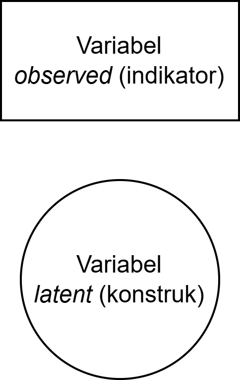
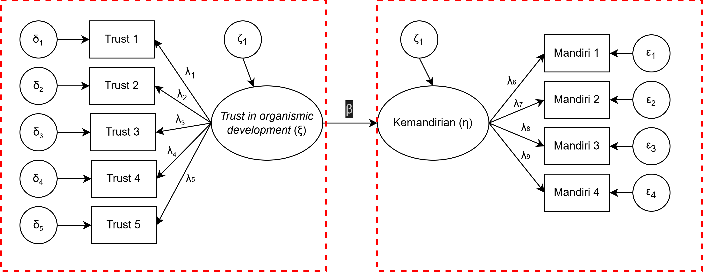

## *Outline*

* Apa yang dimaksud dengan variabel laten?
* _Classical Test Theory_ sebagai model variabel laten paling sederhana
* Reliabilitas dan *measurement error*: mengapa skor observasi selalu mengandung *noise*
* *Attenuation bias*: bagaimana *measurement error* mendistorsi estimasi hubungan antar-variabel
* Keluarga model variabel laten: CTT → EFA → CFA → SEM
* Variabel laten dalam model *reflektif* vs *formatif*
* Pilihan perangkat lunak
* Cakupan materi dan keterbatasannya

# Psikologi mengukur hal-hal yang tidak bisa dilihat {background-color="#14497F" .center}

## Psikologi vs. Fisika

{fig-align="center" width="55%"}

::: {.incremental}
* Fisika mengukur massa, kecepatan, suhu — semuanya bisa dikuantifikasi langsung dengan alat fisik.
* Psikologi mengukur **kecemasan**, **kepribadian**, **motivasi** — konstruk yang tidak bisa ditimbang atau diukur dengan penggaris.
* Pertanyaannya: bagaimana kita tahu bahwa alat ukur kita benar-benar mengukur konstruk yang dimaksud?
:::

## Contoh variabel laten dalam psikologi

::: {.incremental}
* **Kecemasan** — tidak bisa diobservasi langsung, tetapi bisa diinferensi (i.e., disimpulkan) dari detak jantung cepat, telapak tangan berkeringat, sulit konsentrasi, dan laporan subjektif individu.

* **Kepribadian (Big 5)** — *Openness*, *Conscientiousness*, *Extraversion*, *Agreeableness*, *Neuroticism* merupakan konstruk laten yang diukur melalui respon terhadap item-item pernyataan.

* **Prestasi belajar** — tidak sepenuhnya tercermin dari nilai ujian saja; ada faktor *measurement error* dalam setiap tes.

* Semua konstruk ini disebut **variabel laten** (*latent variable*): variabel yang **tidak dapat diamati secara langsung**, tetapi dapat diinferensi dari variabel lain yang bisa diukur (*observed variables*).
:::

## Variabel *observed* vs variabel *laten*

:::: {.columns}
::: {.column width="55%"}

::: {.incremental}
* **Variabel *observed*** (variabel manifes)
  - Variabel yang **dapat diukur atau diamati secara langsung**.
  - Dalam skala psikologi: setiap *item* pernyataan adalah variabel *observed*.
  - Dalam studi eksperimen: skor tes, waktu reaksi, frekuensi perilaku.

* **Variabel *laten***
  - Konstruk yang **tidak dapat diukur secara langsung** — hanya bisa diinferensi.
  - Membutuhkan seperangkat variabel *observed* untuk mengoperasionalisasikannya.
  - Variabel *observed* berperan sebagai **indikator** dari variabel laten.
:::

:::
::: {.column width="45%"}

{fig-align="center" width="90%"}

:::
::::

# Classical Test Theory (CTT) {background-color="#14497F" .center}

## *Classical Test Theory*: X = T + E

* Psikometri klasik mengasumsikan bahwa setiap **skor observasi** (*observed score*, **X**) terdiri atas dua komponen:

$$X = T + E$$

::: {.incremental}
* **T** (*true score*): skor yang *seharusnya* diperoleh seseorang apabila pengukuran dilakukan dengan sempurna — bebas dari *noise* apapun.
* **E** (*error*): *measurement error* — semua *noise* yang membuat skor observasi menyimpang dari skor murni.
  - Kondisi fisik/kesehatan partisipan saat mengisi kuesioner
  - Ambiguitas item pernyataan
  - Perubahan suasana hati sesaat (*state*)
  - Faktor situasional lainnya
:::

::: {.callout-tip}
#### Implikasi penting
CTT mengasumsikan bahwa **rata-rata *error* adalah nol** (E(e) = 0) dan ***error* tidak berkorelasi dengan skor murni** (Cov(T, E) = 0). Artinya, *error* bersifat *stochastic* (acak), bukan sistematis.
:::

## Reliabilitas: seberapa besar T dalam X?

* Apabila X = T + E, maka varians skor observasi (σ²ₓ) juga terdiri atas varians *true score* (σ²ᴛ) dan varians *error* (σ²ₑ):

$$\sigma^2_X = \sigma^2_T + \sigma^2_E$$

* **Reliabilitas** (ρ) didefinisikan sebagai proporsi varians *true score* terhadap varians total:

$$\rho_{XX'} = \frac{\sigma^2_T}{\sigma^2_X} = \frac{\sigma^2_T}{\sigma^2_T + \sigma^2_E}$$

| Reliabilitas (α atau ω) | Interpretasi |
|-------------------------|--------------|
| ≥ 0.90 | Sangat tinggi — *excellent* |
| 0.80 – 0.89 | Tinggi — *good* |
| 0.70 – 0.79 | Cukup — *acceptable* |
| 0.60 – 0.69 | Sedang — perlu perbaikan |
| < 0.60 | Rendah — *poor* |

## *Measurement error* dan *attenuation bias*

* Persoalannya, kita tidak bisa mengukur **T** secara langsung, yang kita ukur selalu **X** (yang sudah "tercemari" oleh *error*).

* Konsekuensinya, ketika kita mengestimasi **korelasi antar-variabel**, korelasi yang kita hitung sebenarnya adalah korelasi antar *observed scores* (rₓᵧ), bukan korelasi antar *true scores* (rᴛₓᴛᵧ).

* Ini menyebabkan **bias atenuasi**: korelasi yang kita estimasi **selalu lebih kecil** dari korelasi yang sebenarnya:

$$r_{XY} = r_{T_X T_Y} \times \sqrt{\rho_{XX'} \times \rho_{YY'}}$$

::: {.callout-warning}
#### *Attenuation bias*
Semakin rendah reliabilitas alat ukur, semakin besar distorsi (*noise*) pada estimasi korelasi. Ini berarti *measurement error* yang tinggi akan membuat kita *underestimate* kekuatan hubungan antar-variabel yang sesungguhnya.
:::

## Implikasi *attenuation bias*

**Contoh nyata**: Misalkan korelasi *true scores* antara kecemasan dan prokrastinasi adalah **0.60**. Tetapi skala kecemasan yang digunakan memiliki reliabilitas **0.70** dan skala prokrastinasi **0.65**.

Korelasi yang akan kita temukan di data:

$$r_{XY} = 0.60 \times \sqrt{0.70 \times 0.65} = 0.60 \times 0.674 = \mathbf{0.40}$$

::: {.incremental}
* Dengan kata lain, kita akan **melaporkan korelasi 0.40** padahal hubungan yang sesungguhnya adalah **0.60**. Perbedaan ini sangat substansial!
* Ini juga berdampak pada ***effect size*** dalam regresi: koefisien regresi (β) pun ikut teratenuasi.
* Oleh karena itu, kita membutuhkan model statistik yang secara eksplisit **memodelkan dan mengontrol *measurement error***. Inilah kegunaan utama *latent variable modeling*.
:::

::: {.callout-tip}
#### Koreksi atenuasi
Korelasi *true scores* dapat diestimasi dari korelasi *observed scores* dengan **koreksi atenuasi**: $r_{T_X T_Y} = \frac{r_{XY}}{\sqrt{\rho_{XX'} \times \rho_{YY'}}}$
:::

# Keluarga model variabel laten {background-color="#14497F" .center}

## Dari CTT ke SEM: satu keluarga besar

| Model | Apa yang dimodelkan | Kelebihan dibanding CTT |
|-------|---------------------|-------------------------|
| **CTT** | X = T + E (level item) | Fondasi — sederhana, tapi tidak menguji struktur laten |
| **EFA** | Struktur faktor laten yang tidak diketahui | Menemukan faktor laten dari suatu dataset (*data-driven*) |
| **CFA** | Struktur faktor laten yang sudah dihipotesiskan oleh teori | Menguji validitas konstruk berdasarkan teori |
| **SEM** | Hubungan antar faktor laten + model pengukuran | Menguji hubungan antara variabel laten sesuai yang dihipotesiskan oleh teori |

::: {.callout-note}
Keempat model ini membentuk **satu kontinum** dari yang paling sederhana (CTT) ke yang paling kompleks (SEM). Setiap model yang lebih kompleks *mengandung* logika model sebelumnya.
:::

## Apa yang EFA dan CFA tambahkan dibandingkan CTT?

::: {.incremental}
* **CTT** bekerja di level *item* — hanya bisa menghitung reliabilitas dan korelasi item-total. CTT tidak menguji apakah item-item tersebut memang mengukur konstruk laten yang sama.

* **EFA** (*Exploratory Factor Analysis*) memungkinkan kita untuk *menemukan* struktur faktor laten dari data. Berguna saat teori belum terlalu matang bukti empirisnya atau sedang dalam tahap eksplorasi.

* **CFA** (*Confirmatory Factor Analysis*) memungkinkan kita untuk *menguji* apakah struktur faktor yang dihipotesiskan berdasarkan teori **didukung oleh data**. Ini adalah uji **validitas konstruk** yang paling ketat.

* **SEM** menggabungkan model pengukuran (CFA) dengan model struktural (regresi/jalur) untuk menguji hipotesis teoritis yang kompleks sekaligus mengontrol *measurement error*.
:::

## Komponen model SEM

{fig-align="center"}

## Model pengukuran (*measurement model*)

{fig-align="center"}

# Model Reflektif vs. Formatif {background-color="#14497F" .center}

## Dua cara variabel laten "bekerja"

::: {.incremental}
* Dalam *latent variable modeling*, ada dua cara konseptual yang berbeda untuk memahami hubungan antara variabel laten dan indikatornya.

* **Model reflektif**: variabel **laten menyebabkan** indikator bervariasi.
  - Jika depresi seseorang meningkat → skor pada item "saya merasa sedih", "saya kehilangan minat", "saya sulit tidur" *semuanya* akan meningkat.
  - Indikator harus saling berkorelasi tinggi — mereka semua "mencerminkan" konstruk yang sama.

* **Model formatif**: indikator **membentuk/mendefinisikan** variabel laten.
  - "Status sosioekonomi" dibentuk oleh pendidikan, pendapatan, dan pekerjaan — menaikkan pendidikan tidak otomatis menaikkan pendapatan.
  - Indikator tidak harus saling berkorelasi.
:::

## Reflektif vs. Formatif: visualisasi

::: {.columns}
::: {.column}

{fig-align="center"}

**Reflektif**: panah dari laten ke indikator

:::
::: {.column}

{fig-align="center"}

**Formatif**: panah dari indikator ke laten

:::
:::

::: {.callout-warning}
#### Mengapa ini penting?
Mayoritas konstruk psikologi menggunakan model **reflektif**, misalnya: skala kepribadian, kecemasan, depresi, dll. Menggunakan model formatif untuk konstruk reflektif (atau sebaliknya) adalah kesalahan konseptual yang serius.
:::

# Perangkat lunak {background-color="#14497F" .center}

## Pilihan perangkat lunak

::: {.incremental}
* **`jamovi`** — antarmuka grafis (*point-and-click*), gratis dan *open source*. Digunakan dalam workshop ini. *Module* SEMLj menyediakan EFA dan CFA dengan antarmuka yang *user-friendly*.

* **`JASP`** — mirip `jamovi`, antarmuka grafis, gratis. Juga mendukung EFA dan CFA.

* **`lavaan`** di  — *package*  yang paling lengkap dan fleksibel untuk SEM, CFA, EFA. Membutuhkan *coding*, tetapi memberikan kendali penuh atas spesifikasi model.

* **`semopy`** di  — alternatif di , *coding style* mirip `lavaan`.

* **`Mplus`** — perangkat lunak komersial dengan fitur lebih lengkap (termasuk *power analysis* dan simulasi), tetapi *proprietary* (berbayar).
:::

::: {.callout-tip}
#### Untuk workshop ini
Kita akan menggunakan **jamovi** dengan *module* **SEMLj**. Untuk analisis yang lebih lanjut, `lavaan` sangat direkomendasikan.
:::

## Ada pertanyaan❓

{fig-align="center"}

::: {.callout-note}
* Paparan disusun dengan menggunakan  dan [**Quarto**](https://quarto.org) dengan *template* dari [UNAIR Theme](https://github.com/rameliaz/quarto-unair-theme).
* Kontak saya via <i class="fas fa-paper-plane"></i> <a href="mailto:amelia.zein@psikologi.unair.ac.id">amelia.zein@psikologi.unair.ac.id</a>
:::
