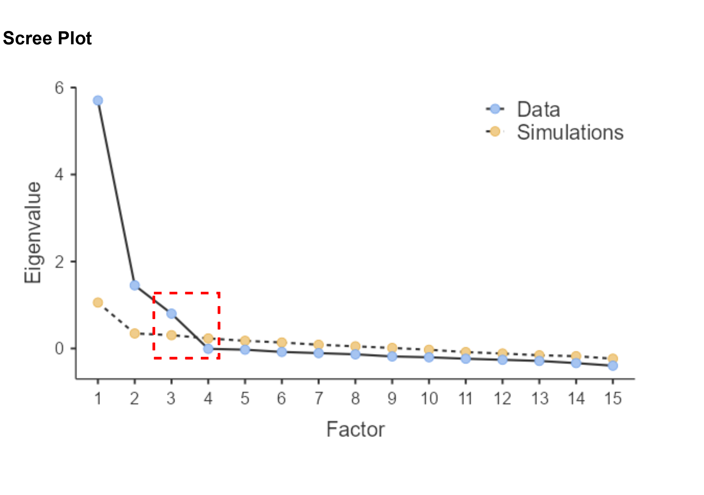

## _Outline_

* Mengapa kita perlu melakukan analisis faktor?
* *Principal Component Analysis* (PCA)
* *Exploratory Factor Analysis* (EFA)
* Asumsi & kesiapan data
* Evaluasi model & pelaporan hasil
* Demonstrasi di `jamovi`

# Mengapa analisis faktor? {background-color="#14497F" .center}

## Bayangkan skala psikologi dengan 20 *item*...

::: {.incremental}
* Seorang peneliti mengembangkan skala **kelelahan kerja** (*burnout*) dengan 20 *item*
* Apakah 20 *item* itu mengukur **20 hal yang benar-benar berbeda**?
* Atau ada **beberapa dimensi laten** yang diwakili oleh beberapa *item* sekaligus?
* Masalah yang muncul kalau tidak ada reduksi:
  - Tidak bisa divisualisasikan (kita akan kesulitan membuat visualisasi 20 *item* sekaligus)
  - Regresi dengan 20 prediktor: risiko *overfitting* sangat tinggi
  - *Item*-*item* yang saling berkorelasi tinggi menunjukkan adanya **redundansi** ➡️ mungkin *item*-*item* ini mengukur dimensi laten yang sama?
:::

## *Measurement error* mendistorsi estimasi

* Kita sudah mempelajari di [**Bagian 1**](https://rameliaz.github.io/statistik-lanjut/slides/bagian-1.html#/title-slide) dan [**Bagian 5**](https://rameliaz.github.io/statistik-lanjut/slides/bagian-5.html#/title-slide) bahwa korelasi antar dua variabel selalu *terlalu kecil* karena terkontaminasi *measurement error* (*attenuation bias*)

* Secara matematis, hubungan antara korelasi yang terobservasi (e.g., nilai *r* dari korelasi Pearson) dengan korelasi *true score* dapat dinyatakan sebagai:

$$r_{XY_{observed}} = r_{T_X T_Y} \times \sqrt{\rho_{XX'} \times \rho_{YY'}}$$

* Analisis faktor **mempartisi** varians per *item* menjadi **sinyal** (*common variance*) dan ***noise*** (*unique variance* = varians spesifik per item + *measurement error*) — tidak seperti PCA yang tidak memisahkan keduanya

::: {.callout-tip}
#### Ingat prinsip dasar korelasi!
Koefisien korelasi yang terobservasi (e.g., *r* pada korelasi Pearson, dsb.) selalu lebih kecil dari korelasi sesungguhnya antar *true score*, karena adanya *measurement error* ini. Analisis faktor membantu kita mendapatkan estimasi korelasi yang lebih akurat.
:::

## Keluarga model variabel laten

| Model | Pertanyaan yang dijawab | Dalam mata kuliah ini |
|-------|-------------------------|-------------------|
| **CTT** | "Seberapa reliabel skor total dari skala psikologi ini?" | [Bagian 5](/docs/slides/bagian-5.html) |
| **EFA** | "Berapa banyak faktor laten yang mendasari *item*-*item* ini?" | **Bagian 7** |
| **CFA** | "Apakah struktur faktor laten yang dihipotesiskan sesuai dengan data?" | [Bagian 8](/docs/slides/bagian-8.html) |
| **SEM** | "Bagaimana keterkaitan antara faktor-faktor laten ini?" | Tidak dibahas dalam mata kuliah ini. [Klik disini apabila tertarik belajar mandiri.](https://rameliaz.github.io/mg-sem-workshop/) |

: {tbl-colwidths="[20,50,30]"}

## EFA vs. CFA

| EFA | CFA |
| :--- | :--- |
| Jumlah faktor **belum diketahui**, kita membiarkan dataset "mengungkap" strukturnya | Jumlah faktor **sudah ditentukan** (melalui hipotesis) sebelum mengambil data |
| Peneliti **tidak memiliki** model hipotesis *a priori* | Peneliti **sudah memiliki** model hipotesis *a priori* |
| Cocok untuk **eksplorasi** dan pengembangan skala | Cocok untuk **konfirmasi** dan pengujian validitas konstruk |

: {tbl-colwidths="[50,50]"}

::: {.callout-warning}
#### Sangat tidak disarankan
...melakukan EFA kemudian CFA pada **sampel yang sama** — kita akan bahas lebih dalam di [Bagian 8](https://rameliaz.github.io/statistik-lanjut/slides/bagian-8.html#/confirmatory-factor-analysis).
:::

# Principal Component Analysis (PCA) {background-color="#14497F" .center}

## Apa itu PCA?

::: {.incremental}
* PCA mencari "arah" (*component*) dalam ruang data yang menangkap **varians sebesar mungkin**
* Hasilnya adalah *principal components* yang merupakan **kombinasi linear** dari suatu set *item*
* Tujuan utama: **reduksi dimensi** — meringkas banyak *item* menjadi sedikit komponen ("*payung*") yang lebih besar
* **Penting**: PCA bukan model pengukuran — ia **tidak mengasumsikan** adanya faktor laten yang menyebabkan *item* bervariasi
:::

:::: {.columns}
::: {.column width="50%"}
**Hierarki komponen:**

* **PC1** — komponen dengan varians terbesar
* **PC2** — *orthogonal* terhadap PC1, komponen dengan varians terbesar berikutnya
* **PC3, PC4, ...** — dst., selalu *orthogonal* (tidak berkorelasi) terhadap semua komponen sebelumnya
:::
::: {.column width="50%"}
**Contoh PCA:**

* Dataset berisi 20 kolom/variabel (*item*)
* *Component scores* = 3–4 kolom skor komposit
* Mempertahankan sebanyak mungkin informasi dengan sesedikit mungkin komponen
:::
::::

## Aplikasi PCA: reduksi dimensi & *machine learning*

::: {.incremental}
* PCA adalah salah satu teknik **_unsupervised learning_** yang paling banyak digunakan dalam *machine learning*
* **Reduksi dimensi sebelum pemodelan prediktif**
  - Dataset dengan ratusan/ribuan variabel (misalnya data genomik, *neuroimaging*, NLP) susah dimodelkan langsung
  - PCA meringkas variabel-variabel yang saling berkorelasi menjadi komponen yang independen (*orthogonal*)
  - Komponen ini kemudian digunakan sebagai prediktor dalam regresi atau klasifikasi, supaya mengurangi *overfitting*
:::

## Aplikasi PCA: reduksi dimensi & *machine learning*

::: {.incremental}
* **Visualisasi data berdimensi tinggi**
  - Plot PC1 vs PC2 memungkinkan kita melihat "peta" distribusi observasi dalam 2D
* **_Feature extraction_** dalam *deep learning* dan *computer vision*
  - Misalnya: ribuan piksel wajah → beberapa *principal components* sebagai *input* model
:::

::: {.callout-note}
#### Aplikasi EFA
EFA memiliki aplikasi yang berbeda, bukan untuk reduksi dimensi secara umum, melainkan khusus untuk **mengidentifikasi konstruk laten** dalam pengembangan dan validasi skala psikologi.
:::

## *Eigenvalue* & *scree plot*

* **Eigenvalue (λ)**: mengukur seberapa banyak varians yang dijelaskan oleh setiap komponen. Total eigenvalue = jumlah *item*.
* **Kaiser *criterion***: pertahankan komponen dengan λ > 1
  - Logika: komponen dengan λ < 1 menjelaskan varians *kurang* dari satu *item* tunggal

::: {.callout-caution}
#### Kaiser *criterion* sering *over-extract*
Kaiser *criterion* bisa menghasilkan terlalu banyak komponen — bahkan dari data yang sepenuhnya acak! Selalu kombinasikan dengan *scree plot* dan *parallel analysis*.
:::

* ***Scree plot***: grafik Eigenvalue dari tertinggi ke terendah — cari "*elbow*" (titik siku) di mana kurva mulai mendatar. Pertahankan komponen **sebelum** *elbow*.

## Contoh *scree plot*

{fig-align="center"}

## *Component loadings* & rotasi

* ***Component loading***: korelasi antara *item* asli dengan komponen. Rentang −1 sampai +1.
  - |loading| > 0.40  *item* bermakna untuk komponen ini (*salient loading*)
  - |loading| < 0.30  *item* tidak relevan untuk komponen ini

* **Rotasi** *item* tujuannya untuk menemukan *simple structure* ([Thurstone, 1954](https://www.cambridge.org/core/journals/psychometrika/article/abs/an-analytical-method-for-simple-structure/C9EE5AE670053FC512D66EC8B964D443)): setiap *item* *loaded* tinggi di **satu** faktor laten, dan mendekati nol di faktor laten yang lain

| | Orthogonal | Oblique |
|---|---|---|
| **Komponen** | Tidak berkorelasi | Boleh berkorelasi |
| **Metode umum** | Varimax | Promax, Direct Oblimin |

: {tbl-colwidths="[25,37,38]"}

::: {.callout-note}
#### Jenis rotasi tidak mengubah varians total
Rotasi **tidak** mengubah total varians yang dijelaskan, tetapi hanya mendistribusikannya agar lebih mudah diinterpretasikan.
:::

# Exploratory Factor Analysis (EFA) {background-color="#14497F" .center}

## PCA vs. EFA

| Aspek | PCA | EFA |
|-------|-----|-----|
| **Tujuan** | Reduksi dimensi; *feature extraction* | Identifikasi & validasi konstruk laten |
| **Posisi dalam ML** | *Unsupervised learning* — *preprocessing* sebelum melakukan pengujian pada *test data* | Psikometri — pengembangan & validasi skala |
| **Model** | Komponen = fungsi linear *item* | *Item* = fungsi linear faktor + *error* pengukuran |
| **Varians yang ingin dijelaskan** | Total varians (termasuk *unique* & *error*) | Hanya *common variance* |
| **Error pengukuran** | Tidak dimodelkan | Dipartisi sebagai *unique variance* per *item* |

: {tbl-colwidths="[28,36,36]"}

## PCA vs. EFA

| Aspek | PCA | EFA |
|-------|-----|-----|
| **Faktor/komponen** | Selalu *orthogonal* (tidak berkorelasi) | Boleh berkorelasi (rotasi *oblique*) |
| **Kapan digunakan** | Tidak ada teori konstruk laten; tujuannya kompresi/menyederhanakan struktur dataset | Ada teori tentang faktor laten; tujuannya mengeksplorasi model pengukuran |

: {tbl-colwidths="[28,36,36]"}

::: {.callout-tip}
#### Catatan
Jika *communalities* tinggi (> 0.60) dan struktur komponen/faktor jelas, hasil PCA dan EFA sering hampir identik. Perbedaan baru muncul ketika *communalities* rendah atau struktur faktor cenderung kompleks (e.g., ada *cross-loading*, dsb.).
:::

## *Communalities* (h²) & *uniqueness*

* ***Communalities* (h²)**: proporsi varians *item* yang dijelaskan oleh *semua* faktor laten yang teridentifikasi

* ***Uniqueness* (u²)**: 1 − h² = varians yang *tidak* dijelaskan oleh faktor manapun (varians spesifik i.e., *unique variance* + *error*)

| h² | Interpretasi |
|:---:|--------------|
| > 0.50 | Baik  |
| 0.30–0.50 | Cukup, tetapi perlu evaluasi |
| < 0.30 | Bermasalah, cek *wording*nya dan pertimbangkan menghapus *item* |

::: {.callout-warning}
#### Peringatan
*Item* dengan h² rendah mengukur faktor laten yang unik (yang tidak dipertimbangkan dalam model EFA) apabila dibandingkan dengan *item* lain.

Evaluasi ulang redaksi (*wording*) *item* tersebut sebelum memutuskan untuk menghapus _item_.

:::

## Menentukan jumlah faktor

::: {.incremental}
* **Kaiser criterion** (λ > 1) — mudah, tapi cenderung *over-extract*. Gunakan sebagai *screening* awal saja.

* ***Scree plot*** — visual dan intuitif, tapi subjektif. Dua peneliti bisa membaca *scree plot* yang sama secara berbeda.

* ***Parallel analysis***  **direkomendasikan**
  - Bandingkan eigenvalue data dengan eigenvalue dari **data acak/simulasi** (dimensi yang sama)
  - Pertahankan faktor di mana eigenvalue dari data **>** eigenvalue simulasi (persentil ke-95)
  - Paling akurat secara empiris; mengurangi potensi subjektivitas ([Hayton, Allen & Scarpello, 2004](https://journals.sagepub.com/doi/abs/10.1177/1094428104263675))

* **Teori** — berapa faktor laten yang disebutkan di literatur?
:::

::: {.callout-tip}
#### Praktik terbaik
Gunakan kombinasi ***parallel analysis*** + *scree plot* + teori sebagai dasar keputusan. Di `jamovi`, *parallel analysis* tersedia langsung di menu EFA.
:::

## Rotasi dalam EFA

::: {.incremental}
* ***Orthogonal*** (faktor tidak berkorelasi) — Varimax
  - Menghasilkan satu matriks: *factor loadings*
  - Asumsi independensi sering **tidak realistis** dalam psikologi

* ***Oblique*** (faktor boleh berkorelasi) — Promax, Direct Oblimin
  - Menghasilkan *pattern matrix* (kontribusi unik faktor ke *item*) — **ini yang dilaporkan**
  - Juga menghasilkan *structure matrix* dan *factor correlation matrix*
:::

::: {.callout-tip}
#### Konstruk laten hampir selalu saling berkorelasi
Konstruk psikologi hampir **selalu berkorelasi**. Gunakan rotasi **oblique** sebagai opsi *default*. Jika korelasi antar faktor sangat rendah (< 0.15), rotasi _orthogonal_ bisa dipertimbangkan.
:::

## Metode ekstraksi di `jamovi`

| Metode | Asumsi | Kapan digunakan |
|--------|--------|-----------------|
| **Minimum Residual (MinRes)** | Tidak perlu memenuhi asumsi normalitas | *Default* yang aman untuk data skala psikologi; meminimalkan residual korelasi |
| **Principal Axis Factoring (PAF)** | Tidak diperlukan normalitas | Data tidak normal; sampel moderat |
| **Maximum Likelihood (ML)** | Normalitas multivariat | Data mendekati normal; ingin *fit indices* formal (RMSEA, CFI) |

: {tbl-colwidths="[30,30,40]"}

::: {.callout-note}
Untuk skala *Likert* yang tidak terlalu juling, **MinRes sudah cukup baik**. Gunakan ML jika ingin melaporkan *fit indices* secara formal dalam artikel.
:::

# Asumsi & Kesiapan Data {background-color="#14497F" .center}

## *Kaiser-Meyer-Olkin* (KMO)

* Pertanyaan sentralnya: apakah pola korelasi antar *item* cukup koheren untuk analisis faktor?

| KMO | Interpretasi |
|-----|:------------:|
| > 0.90 | *Marvelous* |
| 0.80–0.90 | *Meritorious* |
| 0.70–0.80 | *Middling* |
| 0.60–0.70 | *Mediocre* |
| 0.50–0.60 | *Miserable* |
| < 0.50 | Tidak layak — jangan lanjutkan EFA |

## Bartlett's *test of sphericity*

* H₀: matriks korelasi = matriks dengan asumsi *identity* (tidak ada korelasi antar *item* atau korelasi antar*item* = 0)
* _p_ < .05  tolak H₀  ada korelasi yang cukup  EFA layak dilakukan

## *Rule of thumb* berapa *sample size* yang dibutuhkan

| N | Keterangan |
|---|------------|
| < 100 | Tidak memadai — hindari |
| 100–200 | Minimal, hanya jika *loadings* tinggi (> 0.70) |
| 200–300 | Cukup |
| 300–500 | Baik |
| > 500 | Sangat baik |

* Aturan rasio *item*:partisipan yang **direkomendasikan**: 10:1
  - Contoh: 20 *item*  targetkan N ≥ 200, idealnya N ≥ 300
* *Loadings* rendah dan *communalities* rendah membutuhkan *N* yang lebih besar 
  - Jangan memaksakan analisis faktor pada sampel yang terlalu kecil

# Evaluasi & Pelaporan {background-color="#14497F" .center}

## *Fit indices* (khusus ekstraksi ML)

::: {.incremental}
* **Chi-square (χ²)**: H₀ = model fit sempurna; *p* > .05 = justru diinginkan. Artinya, tidak ada perbedaan signifikan antara model yang dihipotesiskan dengan data
  - **Masalah**: sangat sensitif terhadap N besar, sehingga hampir selalu signifikan jika N besar, meskipun model sebenarnya *fit*
  - Oleh karena itu, jangan jadikan satu-satunya kriteria

* **RMSEA** < .05 = sangat baik; .05–.08 = cukup baik; > .10 = tidak dapat diterima
  - Selalu sertakan **90% CI**

* **CFI/TLI** > .95 = baik; > .90 = model EFA dapat diterima
:::

::: {.callout-note}
#### Catatan
Ambang batas RMSEA < .06 ([Hu & Bentler, 1999](https://www.tandfonline.com/doi/abs/10.1080/10705519909540118)) sering dikutip, tapi berasal dari kondisi simulasi yang spesifik. Untuk model dengan banyak indikator atau sampel besar, **RMSEA < .08 sudah dapat diterima**, jangan terlalu kaku mematok *cutoff* pada angka .06.
:::

## Reliabilitas: alpha vs. omega

:::: {.columns}
::: {.column width="50%"}

**Cronbach's α**

* Mengukur konsistensi internal
* Mengasumsikan semua *item* berkontribusi (*factor loadings*) *sama* (*tau-equivalence*)
* Jika *loadings* berbeda-beda, α adalah *lower bound* reliabilitas — hanya berlaku untuk skala **unidimensional**
* Pada skala **multidimensional**, α justru bisa ***overestimate*** reliabilitas satu faktor karena menyerap varians dari faktor lain yang tidak relevan
* Sensitif terhadap jumlah *item*, lebih banyak *item* = α lebih tinggi, meskipun *loadings* cenderung moderat

:::
::: {.column width="50%"}

**McDonald's ω (Omega)**

* Dihitung langsung dari *factor loadings*
* Tidak mengasumsikan *tau-equivalence*, tetapi model *congeneric*
* Lebih akurat ketika *loadings* item tidak setara, yang hampir selalu terjadi pada skala psikologi pada umumnya

:::
::::

::: {.callout-tip}
#### Laporkan α dan ω 
Jika ω > α secara substansial, berarti asumsi *tau-equivalence* tidak terpenuhi. Keduanya tersedia langsung di `jamovi`.
:::

## Checklist pelaporan EFA

☐ **Deskripsi sampel** — N, karakteristik, cara pengumpulan data

☐ **Prosedur analisis** — *software*, metode ekstraksi, kriteria jumlah faktor, jenis rotasi

☐ **Kelayakan analisis** — nilai KMO, hasil Bartlett's test (χ², df, p)

☐ **Hasil ekstraksi** — jumlah faktor yang dipertahankan, eigenvalue, % varians tiap faktor dan total

☐ ***Pattern matrix*** setelah rotasi, lengkap dengan komunalitas (h²)

☐ **Korelasi antar faktor** — jika menggunakan rotasi oblique

☐ **Reliabilitas** — Cronbach's α dan/atau McDonald's ω per faktor

☐ ***Fit indices*** — RMSEA + 90% CI, CFI, TLI (jika menggunakan ML)

## Kesalahan umum dalam EFA

::: {.incremental}
* **Hanya mengandalkan Kaiser criterion**  menghasilkan terlalu banyak faktor. Selalu gunakan *parallel analysis*.

* **Menggunakan PCA untuk pengembangan skala**  PCA bukan model pengukuran. Gunakan EFA.

* **Rotasi orthogonal tanpa alasan**  konstruk psikologi hampir selalu berkorelasi. Gunakan oblique sebagai *default*.

* **Mengabaikan *cross-loadings***  *item* dengan *cross-loading* > 0.30 menandakan batas konstruk yang tidak jelas — jangan diabaikan.

* **Melaporkan hanya *item* yang "berhasil"**  laporkan semua *item*, termasuk yang dihapus beserta alasannya.

* **Tidak melakukan CFA di sampel independen**  EFA hanya eksplorasi. Validasi strukturnya dengan CFA di sampel yang **berbeda**.
:::

# Demonstrasi di `jamovi` {background-color="#14497F" .center}

## Konteks: *Burnout* pada mahasiswa

* Dataset yang kita gunakan: **Dataset Contoh EFA** ([`dataset-burnout.omv`](/docs/materials/dataset-burnout.omv))
 
* **Konteks penelitian:** Data simulasi yang merepresentasikan _burnout_ akademik mahasiswa pascasarjana

* **Pertanyaan penelitian**: berapa dimensi laten yang mendasari *item*-*item* dalam skala *burnout* ini?

* **Variabel demografis:**
  - `usia`: 20–35 tahun
  - `jenis_kelamin`: 0 = Perempuan, 1 = Laki-laki
  - `semester`: semester aktif (1–4)
  - `ipk`: Indeks Prestasi Kumulatif (2.00–4.00)

## Konteks: *Burnout* pada mahasiswa

* **Variabel item (15 item, skala Likert 1–5):**
  - `ab_ee_1` s.d. `ab_ee_5`: *Emotional Exhaustion* — merasa lelah, terkuras, kehabisan energi karena tuntutan akademik
  - `ab_cy_1` s.d. `ab_cy_5`: *Cynicism* — sikap jarak, tidak peduli, pesimis terhadap studi
  - `ab_ef_1` s.d. `ab_ef_5`: *Academic Efficacy* — keyakinan pada kemampuan akademik diri sendiri (skor tinggi = efikasi tinggi)

## Langkah-langkah di `jamovi`

:::: {.columns}
::: {.column width="50%"}

**Mengeksekusi EFA:**

1. **Analyses → Factor → Exploratory Factor Analysis**
2. Masukkan semua *item* ke "Variables"
3. **Extraction method**: *Minimum Residual*
4. **Rotation**: *Oblimin*
5. **Number of factors**: *Parallel Analysis*

:::
::: {.column width="50%"}

**Output yang harus dicek:**

☑ *Factor loadings* (sembunyikan |λ| < 0.30)

☑ *Scree plot* + *parallel analysis plot*

☑ Komunalitas (h²)

☑ KMO & Bartlett's test

☑ Reliabilitas (α & ω)

:::
::::

::: {.callout-tip}
#### Urutan membaca output
Asumsi (KMO & Bartlett's)  jumlah faktor (*parallel analysis* + *scree*)  *pattern matrix* (loading & *cross-loading*)  komunalitas  reliabilitas
:::

## Ada pertanyaan❓

{fig-align="center"}

::: {.callout-note}
* Paparan disusun dengan menggunakan  dan [**Quarto**](https://quarto.org) dengan *template* dari [UNAIR Theme](https://github.com/rameliaz/quarto-unair-theme).
* Kontak saya via <i class="fas fa-paper-plane"></i> <a href="mailto:amelia.zein@psikologi.unair.ac.id">amelia.zein@psikologi.unair.ac.id</a>
:::
