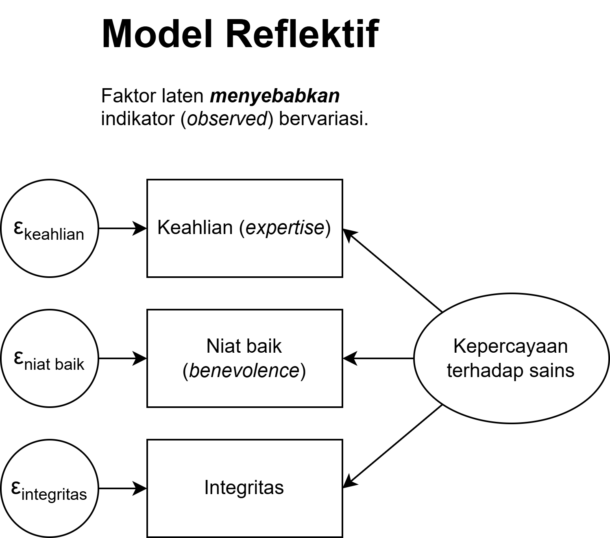
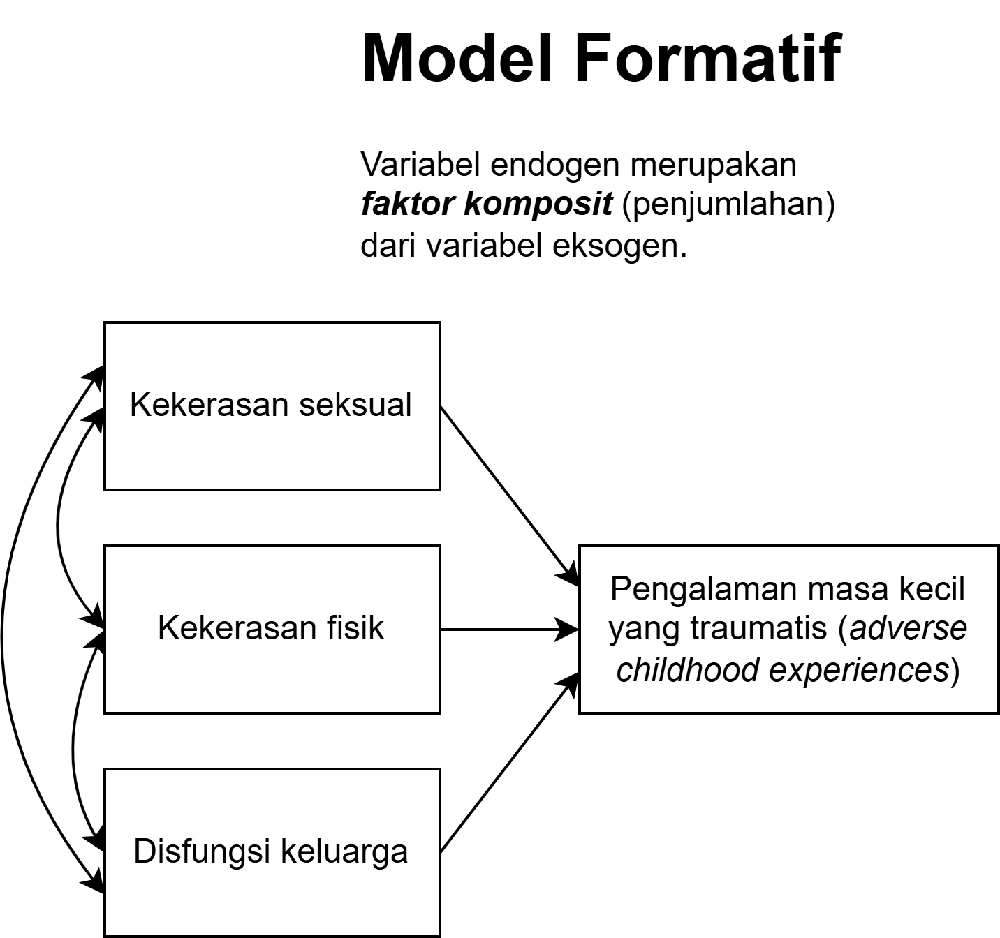
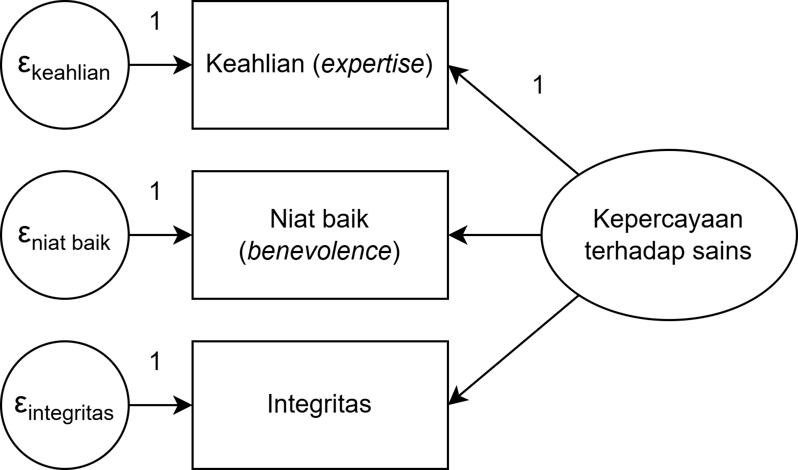
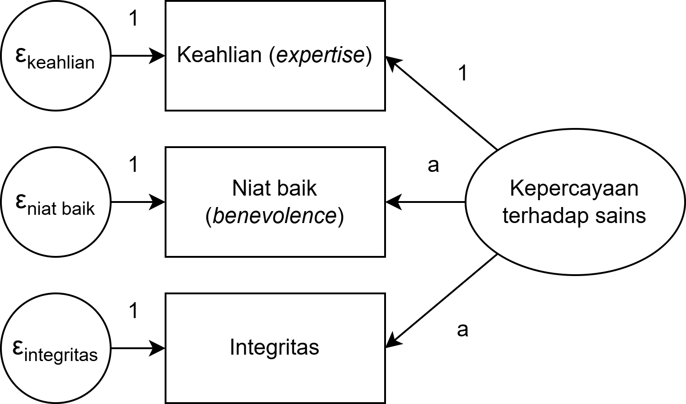
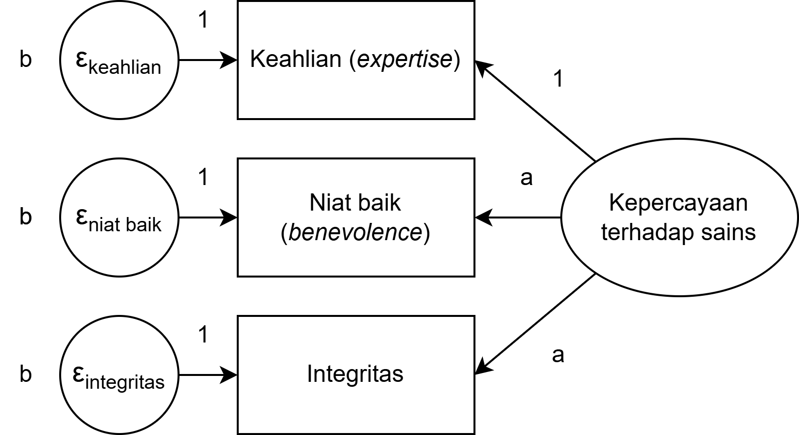
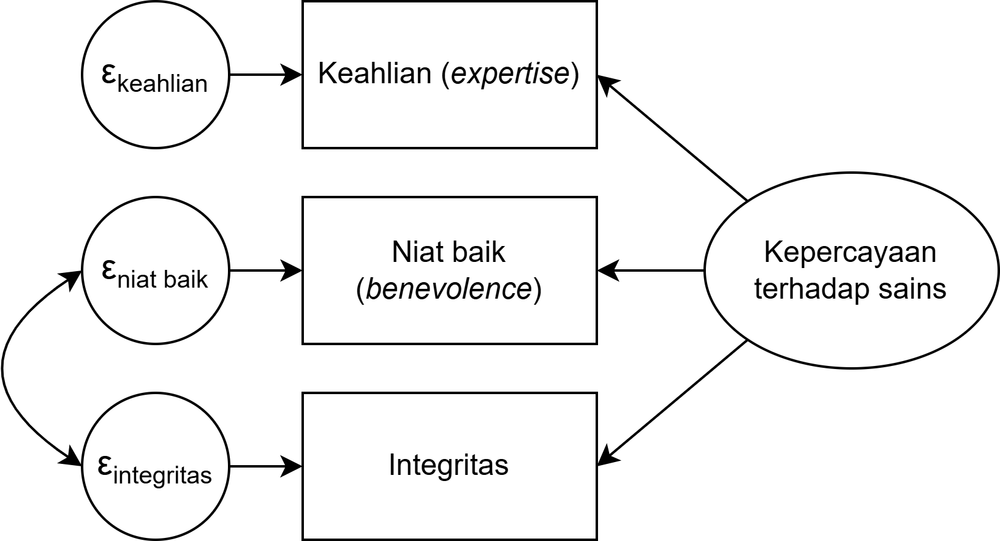

## _Outline_

* Definisi *factor analysis*
* *Exploratory* vs *confirmatory factor analysis*
* Kapan menggunakan CFA?
* Model pengukuran reflektif vs formatif
* Model pengukuran *congeneric*, *tau equivalence*, dan paralel
* [*Constraining parameter* dalam model CFA](https://psycnet.apa.org/record/2008-06808-005)
* *Correlated error variances*
* Metode estimasi
* Identifikasi model
* Evaluasi *model fit*
* Modifikasi model
* *Average Variance Extracted* (AVE) dan *composite reliability*
* CFA dengan `lavaan` 

## Analisis faktor

::: {.columns}
::: {.column width="60%"}
::: {.incremental}

* Awalnya dikembangkan oleh Charles Spearman (1904) untuk menyelidiki [*g factor theory of intelligence*](https://en.wikipedia.org/wiki/G_factor_(psychometrics))

* Terdiri dari:
  - *Exploratory factor analysis* (EFA)
  - *Confirmatory factor analysis* (CFA)

* Analisis faktor digunakan untuk menguji model *common variance*

* Mengasumsikan bahwa dua atau lebih *observed variable* memiliki *shared/common variance* (*commonality* atau *common factor*)  ditunjukkan dengan ***factor loading***

:::
:::
::: {.column width="40%"}

{fig-align="center"}

:::
:::

## EFA vs. CFA

| Exploratory Factor Analysis | Confirmatory Factor Analysis |
| :--- | :--- |
| Mencari model yang cocok menggambarkan data, sehingga peneliti **mengeksplorasi berbagai pilihan model** yang cocok kemudian mencari rasionalisasi teoritisnya | Menguji hipotesis yang **sudah ditentukan sebelumnya**, sehingga peneliti ingin tahu apakah hipotesisnya didukung oleh data |
| Jumlah faktor belum diketahui sampai peneliti melakukan analisisnya | Jumlah faktor sudah ditentukan sebelum mengambil data |
| Peneliti **tidak memiliki** model yang dihipotesiskan *a priori* | Peneliti **sudah memiliki** model hipotesis yang ditentukan *a priori* |

: {tbl-colwidths="[50,50]"}


## *Confirmatory factor analysis*

::: {.incremental}

* Menyediakan solusi untuk mengkoreksi bias karena *measurement error* ketika mengestimasi korelasi antar-variabel

* Cara kerjanya adalah dengan membandingkan [*variance-covariance matrix*](https://rameliaz.github.io/statistik-lanjut/slides/bagian-1.html#/variance-covariance-correlation-matrix-1) yang dihipotesiskan dengan [*variance-covariance matrix*](https://rameliaz.github.io/statistik-lanjut/slides/bagian-1.html#/variance-covariance-correlation-matrix-1) pada data (sampel)

* **Perhatian** 📢
  - **Sangat tidak disarankan** untuk melakukan EFA kemudian CFA pada **sampel yang sama**
  - Karena *generating hypothesis* dengan *testing hypothesis* adalah dua proses yang berbeda yang **tidak seharusnya** dilakukan pada sampel yang sama
  - Kalau hal tsb dilakukan, maka tentu saja peneliti akan mendapatkan hasil yang 'sesuai prediksinya'
  - Ingat [Texas Sharpshooter Fallacy](https://en.wikipedia.org/wiki/Texas_sharpshooter_fallacy)

:::

## _Texas sharpshooter fallacy_

{fig-align="center"}

## Model Reflektif vs. Formatif

::: {.columns}
::: {.column}
::: {.incremental}
**Reflektif**

* **Variabel laten menjelaskan** mengapa **variabel indikator bervariasi**
* Misalnya  individu dengan intelegensi yang tinggi akan mendapatkan nilai yang berbeda dalam tes matematika
* Biasanya mengasumsikan bahwa **kovariansi antar-*error* (*residual*) variabel indikator = 0** (*local independence*)  artinya, korelasi antar-indikator sepenuhnya dijelaskan oleh variabel laten, tidak ada sumber varians bersama lain di luar model
* Mayoritas konstruk psikologis mengasumsikan model pengukuran reflektif

:::
:::

::: {.column}
::: {.incremental}
**Formatif**

* **Variabel *observed* menjelaskan** mengapa **variabel laten bervariasi**
* Misalnya  gengsi sebuah mobil ditentukan oleh usia mobil, kondisi, harga, dan intensitas pemakaian
* Korelasi antara variabel *observed* tidak diketahui
* Biasanya digunakan untuk menentukan indeks pada konstruk yang *orthogonal* (contoh  contohnya, [*adverse childhood experience*](https://www.sciencedirect.com/science/article/abs/pii/S0145213421003434))
* Tetapi, **sangat jarang** konstruk psikologi yang mengasumsikan model formatif

:::
:::
:::

## Model Reflektif

{fig-align="center"}

## Model Formatif

{fig-align="center" width="60%"}

## Jenis-jenis model pengukuran

Ada tiga macam model pengukuran:

* Model _congeneric_
* Model _tau equivalence_
* Model _parallel_

## Model _congeneric_

:::: {.columns}
::: {.column}
::: {.incremental}

* Model yang paling longgar asumsunya dan secara *default* untuk mengestimasi reliabilitas untuk analisis SEM di berbagai perangkat lunak
* Asumsinya, **skala, *error variance*, dan *factor loading* boleh berbeda (dibebaskan)**
* **Koefisien reliabilitas skala** yang mengasumsikan model pengukuran *congeneric*  ω, McDonald's ω, ω total (ω~*t*~), Revelle's ω, *composite reliability*.

:::
:::
::: {.column}

{fig-align="center"}

:::
::::

## Model _tau equivalence_

:::: {.columns}
::: {.column}
::: {.incremental}

* Model yang sedikit lebih rigid daripada *congeneric*
* Asumsinya, **skala dan *error variance* boleh berbeda (dibebaskan)**, namun ***factor loading* harus sama (dibatasi)**
* Ketika asumsi *tau equivalence* dipenuhi, maka [Cronbach's α dapat digunakan](https://www.ncbi.nlm.nih.gov/pubmed/28557467)
* **Koefisien reliabilitas**: Formula Rulon, KR-20, Flanagan-Rulon, Guttman's λ~3~, λ~4~, Hoyt *method*
  - Pada kebanyakan kasus, jarang sekali ada konstruk psikologi yang memenuhi asumsi _tau equivalence_, sehingga **sangat disarankan** untuk tidak menggunakan koefisien reliabilitas yang mengasumsikan _tau equivalence_

:::
:::
::: {.column}

{fig-align="center"}

:::
::::

## Model _parallel_  

:::: {.columns}
::: {.column}

* Model yang paling rigid
* Asumsinya, **skala, *error variance*, dan *factor loading* harus sama (dibatasi)**
  - **Koefisien reliabilitas**: Spearman-Brown's Formula, Standardized α.
:::
::: {.column}

{fig-align="center"}

:::
::::

## [*Constraining parameter* model](https://psycnet.apa.org/record/2008-06808-005)

::: {.incremental}

* **Membatasi (*constraining*) varians faktor laten** = 1 (atau meng*constrain* salah satu *factor loading* = 1, biasanya *item* yang pertama)
  - Ini adalah strategi **identifikasi model** — tanpa melakukan prosedur ini, skala faktor laten tidak terdefinisi dan model tidak dapat diestimasi
  - Efek sampingnya: ketika varians faktor = 1, *factor loading* yang dihasilkan adalah ***standardized estimates*** (dalam satuan SD, bukan satuan item asli)
  - *Default* `lavaan`: varians faktor laten = 1, *mean* = 0

* Membatasi (*constraining*) ***kovarians antar-error*** = 0 (untuk semua pasangan indikator yang berbeda)
  - Ini mengimplikasikan asumsi ***local independence***: korelasi antar-indikator sepenuhnya dijelaskan oleh faktor laten, bukan oleh sumber varians lain
  - *Error variance* masing-masing indikator (diagonal) tetap **bebas** diestimasi

:::

## Apa yang terjadi ketika *error variance* berkorelasi?

{fig-align="center"}

* Kedua variabel indikator tersebut mengukur variabel laten lain di luar model (*unique factor*)
* Bisa jadi karena ada _item_ *unfavorable* dalam skala
  - Oleh karena itu, dua *item* berkorelasi bisa berkorelasi apabila penulisan *item*-nya mirip, hanya saja yang satu positif, sedangkan yang lain penulisannya negatif
  - Untuk mencegah hal ini terjadi, sebaiknya **hindari menulis *item unfavorable* dengan [kalimat negatif](https://pmc.ncbi.nlm.nih.gov/articles/PMC11486723/)**
* Kemungkinan konstruk laten **bukan konstruk tunggal** (multidimensi)
* Perhatikan justifikasi teori ketika menambah *error covariance*

## Memilih metode estimasi 1️⃣

::: {.incremental}

* *Maximum Likelihood*  distribusi data (*multivariate*) normal, level pengukuran harus interval/*continuous*, tidak ada data *missing*
  - Gunakan _Robust Maximum Likelihood_ (MLR) ketika asumsi _multivariate normality_ tidak terpenuhi
  - Untuk data *missing*: ML dengan *listwise deletion* mengharuskan data lengkap; gunakan **FIML** (*Full Information ML*, di `jamovi`: "Options" → "*full information maximum likelihood*" atau `missing = "fiml"` di `lavaan`) yang valid selama data *missing at random* (MAR)

* *Generalized-least squares*  menggunakan asumsi yang sama dengan `ML` namun performanya kurang baik apabila dibandingkan dengan `ML`

:::

## Memilih metode estimasi 2️⃣

::: {.incremental}

* *Weighted-least squares*  dapat digunakan pada data kategorikal (nominal dan ordinal), estimasi menggunakan *polychoric correlation matrix*. Varian WLS, misalnya: WLSM, WLSMV, WLSMVS.

* *Diagonally weighted-least squares*  dapat digunakan pada data kategorikal, bekerja dengan baik pada sampel yang relatif kecil dan data yang tidak berdistribusi normal

:::

::: {.callout-tip}
#### Tips memilih estimator
Untuk **skala _Likert_ dengan 6–7 pilihan**, dengan respons yang relatif simetris, **MLR sudah baik performanya**. Untuk **skala _Likert_ 4 pilihan** dengan distribusi yang sangat juling (_skew_), **WLSMV merupakan pilihan yang lebih aman** ([Rhemtulla, Brosseau-Liard & Savalei](https://psycnet.apa.org/record/2012-18631-001), 2012).
:::

## *Average Variance Extracted* (AVE)

::: {.incremental}

* AVE mengukur **seberapa besar varians pada variabel indikator yang dijelaskan oleh faktor laten**, dibandingkan dengan varians yang berasal dari *error*

* Formula AVE (dengan λᵢ = *standardized factor loading* tiap indikator):

$$AVE = \frac{\sum \lambda_i^2}{\sum \lambda_i^2 + \sum (1 - \lambda_i^2)}$$

* Intinya: dari seluruh varians indikator, berapa proporsinya yang merupakan benar-benar "sinyal" dari konstruk dan bukan *noise*?

* **Kriteria**  AVE ≥ 0.50 ([Fornell & Larcker, 1981](https://doi.org/10.2307/3151312))
  - AVE < 0.50 berarti *error variance* lebih besar daripada *construct variance*  validitas konvergen **tidak terpenuhi**

:::

## AVE vs. *Composite Reliability* (CR)

| | AVE | CR |
| :--- | :--- | :--- |
| **Yang diukur** | Rasio *common variance* dibandingkan total varians per indikator | Reliabilitas (konsistensi internal) skala |
| **Sensitif terhadap** | *Loading* rendah sangat menekan nilai AVE | Kurang sensitif — *loading* tinggi dapat mengompensasi |
| **Kriteria** | ≥ 0.50 | ≥ 0.70 |
| **Kegunaan utama** | Validitas konvergen | Reliabilitas (alternatif Cronbach's α) |

: {tbl-colwidths="[30,35,35]"}

::: {.callout-warning}
#### CR tinggi belum tentu AVE tinggi
Skala dengan *loading* sedang (misalnya semua λ = 0.60, 5 item) bisa menghasilkan CR ≈ 0.78 namun AVE ≈ 0.36. CR fokus pada *"apakah item-item saling berkaitan/berkorelasi?"*; AVE fokus pada *"apakah item-item benar-benar mewakili konstruknya?"*
:::

# Identifikasi Model {background-color="#14497F" .center}

## *Degrees of freedom* dan identifikasi model

::: {.incremental}

* *Degrees of freedom* (df) dalam CFA = jumlah **informasi yang diketahui** (elemen unik *variance-covariance matrix*) dikurangi **parameter yang diestimasi** (e.g., jumlah "jalur" di dalam model CFA).

* Ada tiga kondisi:

| Kondisi | df | Implikasi |
| :--- | :---: | :--- |
| [***Over-identified***]((https://rameliaz.github.io/mg-sem-workshop/slides/bagian-5.html#/over-identified-model)) | > 0 | Lebih banyak informasi dari jumlah parameter — model **dapat diuji** dan difalsifikasi  |
| [***Just-identified***](https://rameliaz.github.io/mg-sem-workshop/slides/bagian-5.html#/just-identified-model) | = 0 | Jumlah informasi yang diketahui = jumlah parameter yang diestimasi — model selalu *fit* sempurna, **tidak dapat difalsifikasi** |
| [***Under-identified***](https://rameliaz.github.io/mg-sem-workshop/slides/bagian-5.html#/under-identified-model) | < 0 | Jumlah parameter lebih banyak dari informasi yang diketahui — model **tidak dapat diestimasi**  |

: {tbl-colwidths="[35,10,55]"}

* **Target**: model harus *over-identified* dengan df ≥ 1 agar bisa diestimasi

:::

## Berapa banyak *item* yang dibutuhkan?

::: {.incremental}

* Aturan umum untuk **satu faktor laten** (varians faktor = 1):
  - **≥ 4 indikator**  *over-identified* (df ≥ 2), dapat diuji
  - **3 indikator**  *just-identified* (df = 0), tidak dapat difalsifikasi
  - **< 3 indikator**  *under-identified*, tidak dapat diestimasi

* **Catatan penting**: aturan di atas khusus untuk model **satu faktor**. Pada model **≥ 2 faktor laten** yang saling berkorelasi, 3 indikator per faktor sudah *over-identified* — tetapi 4+ tetap lebih disarankan agar estimasi model stabil

* Satu indikator per faktor laten (*single-indicator latent variable*) hanya bisa diidentifikasi jika *error variance*-nya **ditentukan secara manual** (misal: dihitung dari reliabilitas × varians skor kasar)

:::

::: {.callout-tip}
#### Cara menghitung df model CFA
Jumlah elemen unik matriks *p* variabel = p(p+1)/2. Parameter yang diestimasi meliputi: *factor loading*, *error variance*, dan korelasi/kovariansi antar-faktor. Selisihnya adalah df model.
:::

# Evaluasi Model Fit {background-color="#14497F" .center}

## Menguji ketepatan model

::: {.incremental}

* Evaluasi *model fit* dilakukan dengan membandingkan **matriks kovarians yang diimplikasikan model** (Σ̂) dengan **matriks kovarians sampel** (S)

* Semakin kecil perbedaan antara Σ̂ dan S  semakin baik *model fit*

* Ada dua level evaluasi:
  - ***Global fit***  apakah model secara keseluruhan cocok dengan data?
  - ***Local fit***  apakah setiap parameter individual (misalnya *factor loading*) signifikan dan masuk akal?

:::

## Chi-square (χ²)

::: {.incremental}

* Uji statistik formal untuk H₀: "Σ̂ = S" (*model-implied* = *sample covariance matrix*)

* **Signifikan** (*p* < .05) berarti model **tidak cocok dengan data** — ada perbedaan sistematis antara model dan data

* **Kelemahan**: sangat sensitif terhadap ukuran sampel — pada *N* besar, hampir selalu signifikan meski perbedaannya kecil

:::

::: {.callout-warning}
#### χ² hampir selalu signifikan pada sampel besar
Gunakan χ² sebagai salah satu dari beberapa indeks, bukan sebagai satu-satunya penentu *model fit*.
:::

## Indeks *model fit* yang direkomendasikan

| Indeks | Kategori | Kriteria | Interpretasi |
| :--- | :--- | :--- | :--- |
| **CFI** | Inkremental | ≥ 0.95 | Membandingkan model vs. *null model* |
| **TLI** | Inkremental | ≥ 0.95 | Seperti CFI, tapi mengoreksi kompleksitas model |
| **RMSEA** | Absolut | < 0.05 | *Close fit* |
| | | 0.05 – 0.08 | *Acceptable fit* |
| | | > 0.10 | *Poor fit* |
| **SRMR** | Absolut | < 0.08 | Rata-rata korelasi residual yang terstandarisasi |

: {tbl-colwidths="[18,22,22,38]"}

## Indeks *model fit* yang direkomendasikan

::: {.callout-tip}
#### Rekomendasi [Hu & Bentler (1999)](https://www.tandfonline.com/doi/abs/10.1080/10705519909540118)
Gunakan **dual cutoff**: CFI ≥ 0.95 **DAN** SRMR ≤ 0.08. Melaporkan hanya satu indeks tidak cukup untuk menilai *model fit* secara komprehensif.
:::

## *Global fit* vs. *Local fit*

:::: {.columns}
::: {.column}
::: {.incremental}
***Global fit***

* Evaluasi model **secara keseluruhan**
* Menggunakan χ², CFI, TLI, RMSEA, SRMR
* Menjawab: *"Apakah model secara umum cocok dengan data?"*
* Model dengan *global fit* yang baik belum tentu semua parameternya masuk akal

:::
:::
::: {.column}
::: {.incremental}
***Local fit***

* Evaluasi **setiap parameter** secara individual
* Meliputi: *factor loading*, *standard error*, nilai-*p*, dan *residual correlation*
* Menjawab: *"Apakah setiap indikator benar-benar mengukur faktor yang dimaksud?"*
* *Factor loading* yang tidak signifikan atau negatif menunjukkan masalah lokal meski *global fit* baik

:::
:::
::::

::: {.callout-note}
#### *Modification indices*
Saat model *fit* kurang baik,`jamovi` menyediakan *modification indices* (MI), yaitu estimasi penurunan χ² jika suatu parameter dibebaskan. **Setiap modifikasi wajib dijustifikasi secara teori**, bukan semata-mata didorong oleh data. Modifikasi tanpa dasar teori merupakan *post-hoc rationalization* yang melemahkan validitas temuan.
:::

# Modifikasi Model {background-color="#14497F" .center}

## Kapan model perlu dimodifikasi?

::: {.incremental}

* Model CFA awal sering kali **tidak langsung menunjukkan indeks *fit* yang memuaskan** 
* Tanda-tanda model perlu dievaluasi ulang:
  - *Global fit* buruk: CFI < 0.90, RMSEA > 0.10
  - *Factor loading* tidak signifikan (p > .05) atau bernilai negatif
  - *Standardized loading* < 0.30 — indikator tidak cukup merepresentasikan faktor
  - *Residual correlation* antar-indikator besar (> 0.10 dalam skala terstandarisasi)

* Ada **dua arah** modifikasi:
  - **Membebaskan parameter** yang semula dikonstrain (misal: menambah *correlated error*)
  - **Mengkonstrain parameter** yang semula bebas (misal: menghapus indikator yang lemah)

:::

## *Modification indices* (MI)

::: {.incremental}

* MI melaporkan **estimasi penurunan χ²** jika satu parameter tertentu dibebaskan
  - MI besar (> 10) menandakan bahwa membebaskan parameter tersebut akan memperbaiki *fit* secara substansial

* Output menunjukkan kolom `mi` (besar penurunan χ²) dan `epc` (*expected parameter change* — seberapa besar estimasi parameternya jika dibebaskan)

* **Perhatian**: MI hanya menunjukkan *apa yang akan memperbaiki fit secara statistik* — bukan *apa yang harus dilakukan*. Setiap modifikasi tetap membutuhkan **alasan substantif**

:::

## Alur modifikasi model yang disarankan

::: {.incremental}

1. **Periksa *local fit* terlebih dahulu** — apakah ada *loading* yang tidak signifikan? 

2. **Baca MI dengan kritis** — fokus pada parameter dengan MI terbesar, tapi pastikan: *"Apakah ini masuk akal secara teori?"*
   - *Correlated error* antara dua item yang memiliki kata-kata serupa (*item overlap*) → **bisa dijustifikasi**
   - *Correlated error* antara item yang tidak berkaitan secara substantif → **sulit dijustifikasi**

3. **Modifikasi satu per satu** — setiap kali membebaskan satu parameter, *re-run* model dan cek ulang MI. Jangan membebaskan banyak parameter sekaligus

4. **Bandingkan model** menggunakan Δχ² (untuk model *nested*) atau ΔCFI (ΔCFI > 0.01 = perbaikan bermakna)

5. **Laporkan semua modifikasi secara transparan** dalam laporan — termasuk yang tidak berhasil

:::

::: {.callout-warning}
#### Modifikasi berbasis data adalah *double-dipping*
Model yang dimodifikasi berdasarkan MI pada sampel yang sama tidak boleh dianggap sebagai model yang "dikonfirmasi". Validasi pada sampel independen adalah syarat utama agar model bisa diinterpretasi.
:::

## *Statistical power* dan ukuran sampel

::: {.incremental}

* Ada **dua level** *power* dalam CFA:

  1. **Level model (***global***)**: apakah sampel cukup untuk mendeteksi model dengan *fit* yang buruk (RMSEA ≥ 0.08) ketika model sebenarnya mendekati baik (RMSEA ≤ 0.05)?
     - H₀: RMSEA ≤ 0.05 ("*close fit*"); H₁: RMSEA ≥ 0.08 ("*poor fit*")
     - **Pada level ini, kita berharap *gagal* menolak H₀** — berbeda dari logika uji hipotesis biasa, di sini H₀ adalah kondisi yang *kita inginkan* (model fit menggambarkan data), bukan kondisi null yang ingin digugurkan

  2. **Level parameter (***local***)**: apakah sampel cukup untuk mendeteksi parameter individual yang tidak nol?
     - **Contoh 1 — *factor loading***: H₀: λ = 0; H₁: λ ≠ 0 → kita berharap **berhasil** menolak H₀ (indikator benar-benar memuat pada faktor)
     - **Contoh 2 — korelasi antar-faktor laten**: jika model dihipotesiskan terdiri dari ≥ 2 faktor, kita juga bisa menguji apakah korelasi antar-faktor laten (φ) berbeda dari nol → H₀: φ = 0; H₁: φ ≠ 0. *Power* yang memadai penting agar korelasi antar-faktor laten dapat dideteksi secara andal

* Analisis *power* dapat menggunakan [modul `PAMLj`](https://blog.jamovi.org/2024/10/28/pamlj.html)

:::

# CFA dengan `lavaan`  {background-color="#14497F" .center}

## `lavaan` *Script*

::: {.incremental}

* `jamovi` menyediakan dua cara untuk mengeksekusi CFA
  - Sebagai fitur standar: "*Factor*" → "*Confirmatory Factor Analysis*"
  - Menggunakan *module* `SEMLj` yang bisa sekaligus mengeksekusi *structural equation modeling* (SEM)
* [`SEMLj`](https://semlj.github.io/) menyediakan dua opsi: fitur _script_ atau _interactive_
  - Kalau memilih fitur _interactive_, maka tampilan antarmukanya berupa _drag & drop_ (seperti `SPSS`). Ini mirip dengan fitur standar `jamovi` di menu *Factor*.
  - Untuk fitur _script_, maka tampilan antarmukanya meminta pengguna untuk menspesifikasi model dengan _script_.

* `jamovi` dan `JASP` mengadopsi *script* dari <i class="fa-brands fa-r-project"></i> *package* [`lavaan`](http://lavaan.ugent.be/tutorial/index.html), sehingga untuk menspesifikasi model, kita harus memasukkan **serangkaian perintah**.

* Meskipun begitu, *script* `lavaan` **sangat sederhana** dan familiar dengan *script* `lavaan` memberikan **banyak keuntungan**.
  - Mendorong memampuan berpikir komputasi yang dapat berkontribusi pada [kemampuan *problem solving*](https://cacm.acm.org/blogcacm/computational-thinking-the-idea-that-lived/).

:::

## Dasar *script* `lavaan`

* Operator utama yang perlu diketahui:

| Operator | Arti | Contoh |
| :---: | :--- | :--- |
| `=~` | *"is measured by"* — mendefinisikan faktor laten | `F =~ x1 + x2 + x3` |
| `~~` | Kovarians/korelasi — antar-faktor atau antar-*error* | `x1 ~~ x2` |
| `~1` | *Intercept* variabel | `F ~1` |

: {tbl-colwidths="[15,50,35]"}

::: {.callout-tip}
#### Satu faktor, tiga indikator atau lebih
Untuk model CFA satu faktor, cukup tuliskan `Faktor =~ item1 + item2 + item3 + ...`. `lavaan` secara *default* membebaskan semua *factor loading* dan *error variance*, serta mengidentifikasi model dengan mengfiksasi varians faktor laten = 1.
:::

## Dasar *script* `lavaan`

{fig-align="center" width="55%"}

::: {.aside}
Baujean, A.A. (2014). Latent Variable Modeling Using R: A step-by-step guide. New York: Routledge.
:::

## Contoh *script* `lavaan` untuk CFA 

{fig-align="center" width="80%"}

```{r}
#| eval: false

# CFA — spesifikasi minimal yang diperlukan
# lavaan secara default membebaskan semua factor loading dan error variance
# serta mengfiksasi varians faktor laten = 1 (tidak perlu ditulis eksplisit)
model_trust <- '
  trust =~ trust1 + trust2 + trust3 + trust4 + trust5
'
```

## Menambahkan *correlated error* dalam `lavaan`

Jika MI menunjukkan bahwa residal (*error*) dari dua item perlu dibebaskan korelasinya, maka:

```{r}
#| eval: false
model_cfa_v2 <- '
  faktor_laten =~ item1 + item2 + item3 + item4 + item5

  # Bebaskan korelasi error item3 dan item4
  # (justifikasi: kedua item memiliki wording yang serupa)
  item3 ~~ item4
'
```

# Demonstrasi CFA dan power analysis {background-color="#14497F" .center}

[Unduh Dataset Contoh CFA](https://rameliaz.github.io/mg-sem-workshop/contoh-cfa.omv)

## Latihan mandiri: Mencoba *confirmatory factor analysis*

* Unduh [Dataset Latihan](https://rameliaz.github.io/mg-sem-workshop/materials/dataset-pilpres2024.csv)

* Unduh [Kamus Data disini](https://rameliaz.github.io/mg-sem-workshop/materials/codebook-pilpres2024.csv)

* Lakukan CFA pada skala *social dominance orientation*
  - Diukur dengan skala *Likert*, 6 _item_ dengan 7 pilihan jawaban

* Laporkan *model fit*, *factor loading*, dan *multivariate normality*

## Ada pertanyaan❓

{fig-align="center"}

::: {.callout-note}
* Paparan disusun dengan menggunakan  dan [**Quarto**](https://quarto.org) dengan *template* dari [UNAIR Theme](https://github.com/rameliaz/quarto-unair-theme).
* Kontak saya via <i class="fas fa-paper-plane"></i> <a href="mailto:amelia.zein@psikologi.unair.ac.id">amelia.zein@psikologi.unair.ac.id</a>
:::
