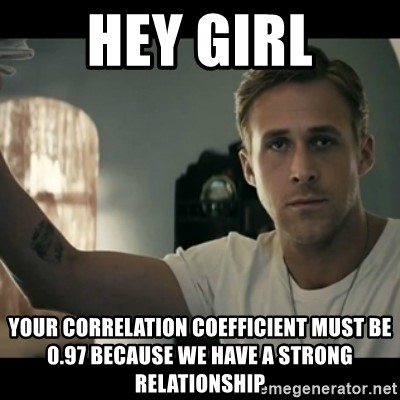

```{r setup, include=FALSE}
options(width = 120)
```

## {background-color="#14497F"}

   

### Rizqy Amelia Zein

* Dosen, [Fakultas Psikologi, Universitas Airlangga](https://psikologi.unair.ac.id)
* Anggota, [#SainsTerbuka Airlangga](https://sainsterbukaua.github.io/) 
* Relawan, [INA-Rxiv](https://inarxiv.id)
* Researcher-in-training, [Institute for Globally Distributed Open Research and Education (IGDORE)](https://igdore.org/)

## Mengapa memulai dari korelasi? {background-color="#14497F"}

LVM-SEM merupakan teknik yang digunakan untuk **mengestimasi korelasi** antar-variabel

. . .

Untuk melakukan SEM, peneliti tidak harus menyediakan data kasar (*raw data*), tetapi ada pilihan untuk meng*input* *correlation* atau *variance-covariance matrix*.


## Jenis-jenis korelasi

| Koefisien Korelasi | Level Pengukuran |
| ------------------ | ---------------- |
| *Pearson's product moment* | Kedua variabel setidaknya interval |
| *Spearman's rank* dan *Kendall's tau* | Kedua variabel ordinal |
| *Phi*, *contingency table* | Kedua variabel nominal |
| *Point biserial* | Variabel interval dengan nominal |
| *Gamma*, *rank biserial* | Variabel ordinal dengan nominal |
| *Biserial* | Variabel interval dengan *dummy* |
| [*Polyserial*](https://link.springer.com/article/10.1007/BF02294164) | Variabel interval dengan variabel *underlying continuity* |
| *Tetrachoric* | Kedua variabel *dummy* (dikotomis) |
| *Polychoric* | Kedua variabel ordinal (dengan kontinuitas implisit) |

## Faktor-faktor yang mempengaruhi korelasi

* **Level pengukuran** (apakah variabel tersebut nominal, ordinal, interval, atau rasio)
  - Sehingga berdampak pada **variabilitas** (*restriction range*) dan **normalitas data**
* **Linearitas**
  - Semua teknik korelasi mengasumsikan korelasi antar-variabel linear, sehingga korelasi yang tidak linear akan memberikan informasi **tidak adanya korelasi** (padahal tidak selalu).
* **Adanya data *outlier* **
* **Koreksi atenuasi**
* **Jumlah sampel**
  - Jumlah sampel yang terlalu sedikit akan memberikan estimasi yang kurang akurat (karena *standard error*nya besar)
* ***Sampling variance***
  - Yang kemudian berefek pada *confidence interval*, *effect size* (koefisien korelasi itu sendiri), dan *statistical power*
* ***Missing data***
  - Kalau data tidak lengkap, estimasi koefisien korelasi akan langsung terdampak.
  - Ada beberapa pilihan yang bisa dilakukan, yaitu  *listwise deletion*, *pairwise deletion*, dan melakukan *data imputation*.
  - *Listwise deletion* tidak disarankan karena membuat jumlah sampel turun drastis  mengurangi *statistical power*.

#### Silahkan unduh dan buka [**Dataset Contoh Korelasi**](https://rameliaz.github.io/lvm-cfa/corr.jasp), untuk melihat contoh.

## {.center}


## *Variance-covariance* dan *correlation matrix* (1)

* Untuk melakukan SEM, maka perangkat lunak membutuhkan *variance-covariance matrix* untuk mengestimasi parameter model
* Pada bagian diagonal *variance-covariance matrix* menunjukkan varians, sedangkan sisanya adalah *covariance*

::: {style="text-align: center;"}

:::

* Jumlah nilai unik (*non-redundant information*) dalam *variance-covariance matrix* adalah ***p*(*p*+1)/2**
  - dimana *p* adalah jumlah *observed variable*
  - Sehingga dengan contoh di atas maka jumlah nilai unik (*non-redundant information*) di *variance-covariance matrix* adalah 3(3+1)/2=6, yaitu **3 varians (diagonal)** dan **3 *covariance* (sisanya)**

## *Variance-covariance* dan *correlation matrix* (2)

:::: {.columns}

::: {.column width="50%"}

* Sebagian besar perangkat lunak SEM menggunakan ***variance-covariance matrix*** bukan *correlation matrix*
  - Ingat ❗ korelasi adalah *standardised covariance*.

* Menggunakan *correlation matrix* biasanya lebih sering menghasilkan **parameter yang *statistically significant* tapi *standard error* yang tidak akurat**.

* Oleh karena itu, meskipun *user* meng*input* *correlation matrix*, maka perangkat lunak akan mengubahnya dulu menjadi *variance-covariance matrix* dulu, baru parameter model dapat diestimasi.

:::

::: {.column width="50%"}


:::

::::

## Koreksi Atenuasi

* Asumsi dasar dalam Psikometri adalah skor kasar (*observed score*) mengandung skor murni (*true score*) dan *measurement error*, sehingga dalam mengestimasi korelasi, *measurement error* perlu dibuang agar estimasi lebih akurat.

* Dengan teknik *koreksi atenuasi*, kita dapat 'membuang' *measurement error*, sehingga kita dapat mengestimasi korelasi antar-variabel menggunakan *true score*-nya.

* Tetapi apabila reliabilitas skala kita kurang baik, maka setelah dikoreksi **koefisien korelasi bisa lebih dari 1** ❗

* Misalnya diketahui bahwa korelasi *observed scores* antar dua variabel (*r*<sub>ab</sub>) adalah 0.9 dan reliabilitas skala *a* (Cronbach's α) adalah 0.6 dan skala *b* adalah 0.7, maka:

::: {style="text-align: center;"}

:::

## WARNING! Covariance/correlation matrix is not positive definite {background-color="#14497F" .center}

::: {style="text-align: center;"}

:::

## Apa yang terjadi? {background-color="#14497F" .center}

#### Perangkat lunak akan menghentikan proses estimasi

#### ...dan memberikan pesan *non-positive definite*


## Matrik korelasi dengan *non-positive definite*

* Koefisien korelasi yang nilainya ≥1 menyebabkan matriks korelasi menjadi *non-positive definite*
  - Artinya, parameter model tidak mungkin diestimasi

* Mengapa terjadi?
  - Data didapatkan dari observasi yang **tidak independen** (*linear dependency*)
  - Terjadi **multikolinearitas**
  - **Jumlah sampel** lebih **sedikit** dari jumlah variabel yang diuji dalam model
  - Sepasang variabel berbagi **varians negatif** atau **tidak sama sekali** (0)  *Heywood case*
  - Varians, kovarians, dan korelasi nilainya diluar batas kewajaran
  - Kesalahan mengatur pembatasan (*constraint*) pada parameter tertentu yang dilakukan oleh peneliti (*user-specified model*)

## *Heywood* dan *ultra-Heywood case*

* Terjadi ketika *communalities* = 1 (*Heywood*) atau ≥1 (*ultra-Heywood*), atau terjadi ketika varians *measurement error* bernilai negatif
  - *Communalities* adalah kuadrat dari koefisien korelasi (*R*<sup>2</sup>)
  - Apabila terjadi, maka ada yang salah dengan spesifikasi model (hipotesis)

* Terjadi karena
  - *Common factor* terlalu banyak/terlalu sedikit
  - Ukuran sampel tidak memadai
  - Model SEM (*common factor model*) bukan model yang cocok untuk menguji hipotesis hubungan antar-variabel (alternatifnya [*Principal Component Analysis* - PCA](https://medium.com/@aptrishu/understanding-principle-component-analysis-e32be0253ef0))

* Yang bisa dilakukan
  - Tinjau kembali hipotesis modelnya
  - Kurangi jumlah faktor laten dengan 'membuang' jalur/korelasi yang bermasalah
  - Identifikasi variabel yang terlibat multikolinearitas. Masukkan salah satu saja dalam model, sisanya sisihkan

## Korelasi Bivariat: *Part* dan *partial correlation*

::: {style="text-align: center;"}

:::

## Metrik variabel (*standardised* vs *unstandardised*)

* *Unstandarised solution/estimates*
  - Dapat **dibandingkan** antar kelompok sampel
  - Merupakan parameter yang digunakan oleh perangkat lunak untuk menghitung *standard error* dan *taraf signifikansi (p-value)*)
  - Membandingkan *unstandardised factor loading* **harus melihat *standard error*nya juga** karena mereka seharusnya sepaket

* *Standarised solution/estimates*
  - Hanya *interpretable* untuk kelompok sampel yang diuji - tidak bisa dibandingkan dengan kelompok sampel yang lain.
  - Berguna untuk membandingkan *factor loading* antar-variabel di dalam model - peneliti dapat **mengidentifikasi variabel mana yang paling berkontribusi** menjelaskan *dependent variable*
  - Apabila variabel dalam model memiliki unit pengukuran yang berbeda, maka *standardised estimates* akan sangat membantu untuk menstandardisasi unit antar-variabel tersebut

* Ada banyak perbedaan pendapat mengenai metrik mana yang harus dilaporkan, tetapi...
  - **Selalu laporkan *unstandarised solution/estimates* dan *standard error*nya** (boleh juga dengan *standarised solution/estimates*, boleh juga tidak)

## Terima kasih banyak! 😉 {.center}


Paparan disusun dengan menggunakan  dan [**Quarto**](https://quarto.org) dengan tema [quarto-unair-theme](https://github.com/rameliaz/quarto-unair-theme).
